### Problem Statement

    Identify products at risk of backorder before the event occurs so that business has time to react.

### What is a Backorder?
    Backorders are products that are temporarily out of stock, but a customer is permitted to place an order against future inventory. A backorder generally indicates that customer demand for a product or service exceeds a company’s capacity to supply it. Back orders are both good and bad. Strong demand can drive back orders, but so can suboptimal planning.

### Data

Data file contains the historical data for the 8 weeks prior to the week we are trying to predict. The data was taken as weekly snapshots at the start of each week. Columns are defined as follows:

    sku - Random ID for the product

    national_inv - Current inventory level for the part

    lead_time - Transit time for product (if available)

    in_transit_qty - Amount of product in transit from source

    forecast_3_month - Forecast sales for the next 3 months

    forecast_6_month - Forecast sales for the next 6 months

    forecast_9_month - Forecast sales for the next 9 months

    sales_1_month - Sales quantity for the prior 1 month time period

    sales_3_month - Sales quantity for the prior 3 month time period

    sales_6_month - Sales quantity for the prior 6 month time period

    sales_9_month - Sales quantity for the prior 9 month time period

    min_bank - Minimum recommend amount to stock

    potential_issue - Source issue for part identified

    pieces_past_due - Parts overdue from source

    perf_6_month_avg - Source performance for prior 6 month period

    perf_12_month_avg - Source performance for prior 12 month period

    local_bo_qty - Amount of stock orders overdue

    deck_risk - Part risk flag

    oe_constraint - Part risk flag

    ppap_risk - Part risk flag

    stop_auto_buy - Part risk flag

    rev_stop - Part risk flag

    went_on_backorder - Product actually went on backorder. This is the target value.

#### Identify Right Error Metrics

    Based on the business, identify right error metrics.
Recall/ TPR
### Data Pre-processing
#### Loading the required libraries


```python
import numpy as np
import pandas as pd
import os
```

Get current working directory


```python
PATH = os.getcwd()
```

Change directory


```python
os.chdir(PATH)
```

#### Loading the data


```python
#Load the Data - Backorders.csv
data = pd.read_csv('BackOrders.csv', na_values=[-99])
data.head()
```


<div>
<style scoped>
    .dataframe tbody tr th:only-of-type {
        vertical-align: middle;
    }

    .dataframe tbody tr th {
        vertical-align: top;
    }

    .dataframe thead th {
        text-align: right;
    }
</style>
<table border="1" class="dataframe">
  <thead>
    <tr style="text-align: right;">
      <th></th>
      <th>sku</th>
      <th>national_inv</th>
      <th>lead_time</th>
      <th>in_transit_qty</th>
      <th>forecast_3_month</th>
      <th>forecast_6_month</th>
      <th>forecast_9_month</th>
      <th>sales_1_month</th>
      <th>sales_3_month</th>
      <th>sales_6_month</th>
      <th>...</th>
      <th>pieces_past_due</th>
      <th>perf_6_month_avg</th>
      <th>perf_12_month_avg</th>
      <th>local_bo_qty</th>
      <th>deck_risk</th>
      <th>oe_constraint</th>
      <th>ppap_risk</th>
      <th>stop_auto_buy</th>
      <th>rev_stop</th>
      <th>went_on_backorder</th>
    </tr>
  </thead>
  <tbody>
    <tr>
      <th>0</th>
      <td>1888279</td>
      <td>117</td>
      <td>NaN</td>
      <td>0</td>
      <td>0</td>
      <td>0</td>
      <td>0</td>
      <td>0</td>
      <td>0</td>
      <td>15</td>
      <td>...</td>
      <td>0</td>
      <td>NaN</td>
      <td>NaN</td>
      <td>0</td>
      <td>No</td>
      <td>No</td>
      <td>Yes</td>
      <td>Yes</td>
      <td>No</td>
      <td>No</td>
    </tr>
    <tr>
      <th>1</th>
      <td>1870557</td>
      <td>7</td>
      <td>2.0</td>
      <td>0</td>
      <td>0</td>
      <td>0</td>
      <td>0</td>
      <td>0</td>
      <td>0</td>
      <td>0</td>
      <td>...</td>
      <td>0</td>
      <td>0.50</td>
      <td>0.28</td>
      <td>0</td>
      <td>Yes</td>
      <td>No</td>
      <td>No</td>
      <td>Yes</td>
      <td>No</td>
      <td>No</td>
    </tr>
    <tr>
      <th>2</th>
      <td>1475481</td>
      <td>258</td>
      <td>15.0</td>
      <td>10</td>
      <td>10</td>
      <td>77</td>
      <td>184</td>
      <td>46</td>
      <td>132</td>
      <td>256</td>
      <td>...</td>
      <td>0</td>
      <td>0.54</td>
      <td>0.70</td>
      <td>0</td>
      <td>No</td>
      <td>No</td>
      <td>No</td>
      <td>Yes</td>
      <td>No</td>
      <td>No</td>
    </tr>
    <tr>
      <th>3</th>
      <td>1758220</td>
      <td>46</td>
      <td>2.0</td>
      <td>0</td>
      <td>0</td>
      <td>0</td>
      <td>0</td>
      <td>1</td>
      <td>2</td>
      <td>6</td>
      <td>...</td>
      <td>0</td>
      <td>0.75</td>
      <td>0.90</td>
      <td>0</td>
      <td>Yes</td>
      <td>No</td>
      <td>No</td>
      <td>Yes</td>
      <td>No</td>
      <td>No</td>
    </tr>
    <tr>
      <th>4</th>
      <td>1360312</td>
      <td>2</td>
      <td>2.0</td>
      <td>0</td>
      <td>4</td>
      <td>6</td>
      <td>10</td>
      <td>2</td>
      <td>2</td>
      <td>5</td>
      <td>...</td>
      <td>0</td>
      <td>0.97</td>
      <td>0.92</td>
      <td>0</td>
      <td>No</td>
      <td>No</td>
      <td>No</td>
      <td>Yes</td>
      <td>No</td>
      <td>No</td>
    </tr>
  </tbody>
</table>
<p>5 rows × 23 columns</p>
</div>


#### Understand the Data

See the number row and columns


```python
data.shape
```


    (61589, 23)


Display the columns


```python
print(data.columns)
print(data.dtypes)
```

    Index(['sku', 'national_inv', 'lead_time', 'in_transit_qty',
           'forecast_3_month', 'forecast_6_month', 'forecast_9_month',
           'sales_1_month', 'sales_3_month', 'sales_6_month', 'sales_9_month',
           'min_bank', 'potential_issue', 'pieces_past_due', 'perf_6_month_avg',
           'perf_12_month_avg', 'local_bo_qty', 'deck_risk', 'oe_constraint',
           'ppap_risk', 'stop_auto_buy', 'rev_stop', 'went_on_backorder'],
          dtype='object')
    sku                    int64
    national_inv           int64
    lead_time            float64
    in_transit_qty         int64
    forecast_3_month       int64
    forecast_6_month       int64
    forecast_9_month       int64
    sales_1_month          int64
    sales_3_month          int64
    sales_6_month          int64
    sales_9_month          int64
    min_bank               int64
    potential_issue       object
    pieces_past_due        int64
    perf_6_month_avg     float64
    perf_12_month_avg    float64
    local_bo_qty           int64
    deck_risk             object
    oe_constraint         object
    ppap_risk             object
    stop_auto_buy         object
    rev_stop              object
    went_on_backorder     object
    dtype: object


See the top rows of the data


```python
data.head(10)
```


<div>
<style scoped>
    .dataframe tbody tr th:only-of-type {
        vertical-align: middle;
    }

    .dataframe tbody tr th {
        vertical-align: top;
    }

    .dataframe thead th {
        text-align: right;
    }
</style>
<table border="1" class="dataframe">
  <thead>
    <tr style="text-align: right;">
      <th></th>
      <th>sku</th>
      <th>national_inv</th>
      <th>lead_time</th>
      <th>in_transit_qty</th>
      <th>forecast_3_month</th>
      <th>forecast_6_month</th>
      <th>forecast_9_month</th>
      <th>sales_1_month</th>
      <th>sales_3_month</th>
      <th>sales_6_month</th>
      <th>...</th>
      <th>pieces_past_due</th>
      <th>perf_6_month_avg</th>
      <th>perf_12_month_avg</th>
      <th>local_bo_qty</th>
      <th>deck_risk</th>
      <th>oe_constraint</th>
      <th>ppap_risk</th>
      <th>stop_auto_buy</th>
      <th>rev_stop</th>
      <th>went_on_backorder</th>
    </tr>
  </thead>
  <tbody>
    <tr>
      <th>0</th>
      <td>1888279</td>
      <td>117</td>
      <td>NaN</td>
      <td>0</td>
      <td>0</td>
      <td>0</td>
      <td>0</td>
      <td>0</td>
      <td>0</td>
      <td>15</td>
      <td>...</td>
      <td>0</td>
      <td>NaN</td>
      <td>NaN</td>
      <td>0</td>
      <td>No</td>
      <td>No</td>
      <td>Yes</td>
      <td>Yes</td>
      <td>No</td>
      <td>No</td>
    </tr>
    <tr>
      <th>1</th>
      <td>1870557</td>
      <td>7</td>
      <td>2.0</td>
      <td>0</td>
      <td>0</td>
      <td>0</td>
      <td>0</td>
      <td>0</td>
      <td>0</td>
      <td>0</td>
      <td>...</td>
      <td>0</td>
      <td>0.50</td>
      <td>0.28</td>
      <td>0</td>
      <td>Yes</td>
      <td>No</td>
      <td>No</td>
      <td>Yes</td>
      <td>No</td>
      <td>No</td>
    </tr>
    <tr>
      <th>2</th>
      <td>1475481</td>
      <td>258</td>
      <td>15.0</td>
      <td>10</td>
      <td>10</td>
      <td>77</td>
      <td>184</td>
      <td>46</td>
      <td>132</td>
      <td>256</td>
      <td>...</td>
      <td>0</td>
      <td>0.54</td>
      <td>0.70</td>
      <td>0</td>
      <td>No</td>
      <td>No</td>
      <td>No</td>
      <td>Yes</td>
      <td>No</td>
      <td>No</td>
    </tr>
    <tr>
      <th>3</th>
      <td>1758220</td>
      <td>46</td>
      <td>2.0</td>
      <td>0</td>
      <td>0</td>
      <td>0</td>
      <td>0</td>
      <td>1</td>
      <td>2</td>
      <td>6</td>
      <td>...</td>
      <td>0</td>
      <td>0.75</td>
      <td>0.90</td>
      <td>0</td>
      <td>Yes</td>
      <td>No</td>
      <td>No</td>
      <td>Yes</td>
      <td>No</td>
      <td>No</td>
    </tr>
    <tr>
      <th>4</th>
      <td>1360312</td>
      <td>2</td>
      <td>2.0</td>
      <td>0</td>
      <td>4</td>
      <td>6</td>
      <td>10</td>
      <td>2</td>
      <td>2</td>
      <td>5</td>
      <td>...</td>
      <td>0</td>
      <td>0.97</td>
      <td>0.92</td>
      <td>0</td>
      <td>No</td>
      <td>No</td>
      <td>No</td>
      <td>Yes</td>
      <td>No</td>
      <td>No</td>
    </tr>
    <tr>
      <th>5</th>
      <td>3002608</td>
      <td>297</td>
      <td>12.0</td>
      <td>0</td>
      <td>0</td>
      <td>0</td>
      <td>0</td>
      <td>5</td>
      <td>6</td>
      <td>44</td>
      <td>...</td>
      <td>0</td>
      <td>0.58</td>
      <td>0.75</td>
      <td>0</td>
      <td>Yes</td>
      <td>No</td>
      <td>No</td>
      <td>Yes</td>
      <td>No</td>
      <td>No</td>
    </tr>
    <tr>
      <th>6</th>
      <td>1707693</td>
      <td>3285</td>
      <td>8.0</td>
      <td>0</td>
      <td>0</td>
      <td>0</td>
      <td>0</td>
      <td>18</td>
      <td>81</td>
      <td>162</td>
      <td>...</td>
      <td>0</td>
      <td>0.61</td>
      <td>0.57</td>
      <td>0</td>
      <td>No</td>
      <td>No</td>
      <td>No</td>
      <td>Yes</td>
      <td>No</td>
      <td>No</td>
    </tr>
    <tr>
      <th>7</th>
      <td>2066128</td>
      <td>6</td>
      <td>2.0</td>
      <td>0</td>
      <td>0</td>
      <td>3</td>
      <td>9</td>
      <td>1</td>
      <td>5</td>
      <td>8</td>
      <td>...</td>
      <td>0</td>
      <td>0.86</td>
      <td>0.77</td>
      <td>0</td>
      <td>No</td>
      <td>No</td>
      <td>No</td>
      <td>Yes</td>
      <td>No</td>
      <td>Yes</td>
    </tr>
    <tr>
      <th>8</th>
      <td>3174990</td>
      <td>99</td>
      <td>8.0</td>
      <td>0</td>
      <td>46</td>
      <td>169</td>
      <td>225</td>
      <td>2</td>
      <td>22</td>
      <td>176</td>
      <td>...</td>
      <td>0</td>
      <td>0.11</td>
      <td>0.37</td>
      <td>0</td>
      <td>No</td>
      <td>No</td>
      <td>No</td>
      <td>Yes</td>
      <td>No</td>
      <td>No</td>
    </tr>
    <tr>
      <th>9</th>
      <td>3021709</td>
      <td>52</td>
      <td>2.0</td>
      <td>0</td>
      <td>0</td>
      <td>0</td>
      <td>0</td>
      <td>0</td>
      <td>0</td>
      <td>0</td>
      <td>...</td>
      <td>0</td>
      <td>0.83</td>
      <td>0.69</td>
      <td>0</td>
      <td>No</td>
      <td>No</td>
      <td>No</td>
      <td>Yes</td>
      <td>No</td>
      <td>No</td>
    </tr>
  </tbody>
</table>
<p>10 rows × 23 columns</p>
</div>


Shows a quick statistic summary of your data using describe.

    For object data (e.g. strings or timestamps), the result’s index will include count, unique, top, and freq. 

        The top is the most common value.

        The freq is the most common value’s frequency.


```python
data.describe(include='all')
```


<div>
<style scoped>
    .dataframe tbody tr th:only-of-type {
        vertical-align: middle;
    }

    .dataframe tbody tr th {
        vertical-align: top;
    }

    .dataframe thead th {
        text-align: right;
    }
</style>
<table border="1" class="dataframe">
  <thead>
    <tr style="text-align: right;">
      <th></th>
      <th>sku</th>
      <th>national_inv</th>
      <th>lead_time</th>
      <th>in_transit_qty</th>
      <th>forecast_3_month</th>
      <th>forecast_6_month</th>
      <th>forecast_9_month</th>
      <th>sales_1_month</th>
      <th>sales_3_month</th>
      <th>sales_6_month</th>
      <th>...</th>
      <th>pieces_past_due</th>
      <th>perf_6_month_avg</th>
      <th>perf_12_month_avg</th>
      <th>local_bo_qty</th>
      <th>deck_risk</th>
      <th>oe_constraint</th>
      <th>ppap_risk</th>
      <th>stop_auto_buy</th>
      <th>rev_stop</th>
      <th>went_on_backorder</th>
    </tr>
  </thead>
  <tbody>
    <tr>
      <th>count</th>
      <td>6.158900e+04</td>
      <td>61589.000000</td>
      <td>58186.000000</td>
      <td>61589.000000</td>
      <td>6.158900e+04</td>
      <td>6.158900e+04</td>
      <td>6.158900e+04</td>
      <td>61589.000000</td>
      <td>61589.000000</td>
      <td>6.158900e+04</td>
      <td>...</td>
      <td>61589.000000</td>
      <td>57248.000000</td>
      <td>57498.000000</td>
      <td>61589.000000</td>
      <td>61589</td>
      <td>61589</td>
      <td>61589</td>
      <td>61589</td>
      <td>61589</td>
      <td>61589</td>
    </tr>
    <tr>
      <th>unique</th>
      <td>NaN</td>
      <td>NaN</td>
      <td>NaN</td>
      <td>NaN</td>
      <td>NaN</td>
      <td>NaN</td>
      <td>NaN</td>
      <td>NaN</td>
      <td>NaN</td>
      <td>NaN</td>
      <td>...</td>
      <td>NaN</td>
      <td>NaN</td>
      <td>NaN</td>
      <td>NaN</td>
      <td>2</td>
      <td>2</td>
      <td>2</td>
      <td>2</td>
      <td>2</td>
      <td>2</td>
    </tr>
    <tr>
      <th>top</th>
      <td>NaN</td>
      <td>NaN</td>
      <td>NaN</td>
      <td>NaN</td>
      <td>NaN</td>
      <td>NaN</td>
      <td>NaN</td>
      <td>NaN</td>
      <td>NaN</td>
      <td>NaN</td>
      <td>...</td>
      <td>NaN</td>
      <td>NaN</td>
      <td>NaN</td>
      <td>NaN</td>
      <td>No</td>
      <td>No</td>
      <td>No</td>
      <td>Yes</td>
      <td>No</td>
      <td>No</td>
    </tr>
    <tr>
      <th>freq</th>
      <td>NaN</td>
      <td>NaN</td>
      <td>NaN</td>
      <td>NaN</td>
      <td>NaN</td>
      <td>NaN</td>
      <td>NaN</td>
      <td>NaN</td>
      <td>NaN</td>
      <td>NaN</td>
      <td>...</td>
      <td>NaN</td>
      <td>NaN</td>
      <td>NaN</td>
      <td>NaN</td>
      <td>48145</td>
      <td>61577</td>
      <td>53792</td>
      <td>59303</td>
      <td>61569</td>
      <td>50296</td>
    </tr>
    <tr>
      <th>mean</th>
      <td>2.037188e+06</td>
      <td>287.721882</td>
      <td>7.559619</td>
      <td>30.192843</td>
      <td>1.692728e+02</td>
      <td>3.150413e+02</td>
      <td>4.535760e+02</td>
      <td>44.742957</td>
      <td>150.732631</td>
      <td>2.835465e+02</td>
      <td>...</td>
      <td>1.605400</td>
      <td>0.767787</td>
      <td>0.763014</td>
      <td>1.205361</td>
      <td>NaN</td>
      <td>NaN</td>
      <td>NaN</td>
      <td>NaN</td>
      <td>NaN</td>
      <td>NaN</td>
    </tr>
    <tr>
      <th>std</th>
      <td>6.564178e+05</td>
      <td>4233.906931</td>
      <td>6.498952</td>
      <td>792.869253</td>
      <td>5.286742e+03</td>
      <td>9.774362e+03</td>
      <td>1.420201e+04</td>
      <td>1373.805831</td>
      <td>5224.959649</td>
      <td>8.872270e+03</td>
      <td>...</td>
      <td>42.309229</td>
      <td>0.251166</td>
      <td>0.243469</td>
      <td>29.981155</td>
      <td>NaN</td>
      <td>NaN</td>
      <td>NaN</td>
      <td>NaN</td>
      <td>NaN</td>
      <td>NaN</td>
    </tr>
    <tr>
      <th>min</th>
      <td>1.068628e+06</td>
      <td>-2999.000000</td>
      <td>0.000000</td>
      <td>0.000000</td>
      <td>0.000000e+00</td>
      <td>0.000000e+00</td>
      <td>0.000000e+00</td>
      <td>0.000000</td>
      <td>0.000000</td>
      <td>0.000000e+00</td>
      <td>...</td>
      <td>0.000000</td>
      <td>0.000000</td>
      <td>0.000000</td>
      <td>0.000000</td>
      <td>NaN</td>
      <td>NaN</td>
      <td>NaN</td>
      <td>NaN</td>
      <td>NaN</td>
      <td>NaN</td>
    </tr>
    <tr>
      <th>25%</th>
      <td>1.498574e+06</td>
      <td>3.000000</td>
      <td>4.000000</td>
      <td>0.000000</td>
      <td>0.000000e+00</td>
      <td>0.000000e+00</td>
      <td>0.000000e+00</td>
      <td>0.000000</td>
      <td>0.000000</td>
      <td>0.000000e+00</td>
      <td>...</td>
      <td>0.000000</td>
      <td>0.680000</td>
      <td>0.680000</td>
      <td>0.000000</td>
      <td>NaN</td>
      <td>NaN</td>
      <td>NaN</td>
      <td>NaN</td>
      <td>NaN</td>
      <td>NaN</td>
    </tr>
    <tr>
      <th>50%</th>
      <td>1.898033e+06</td>
      <td>10.000000</td>
      <td>8.000000</td>
      <td>0.000000</td>
      <td>0.000000e+00</td>
      <td>0.000000e+00</td>
      <td>0.000000e+00</td>
      <td>0.000000</td>
      <td>2.000000</td>
      <td>4.000000e+00</td>
      <td>...</td>
      <td>0.000000</td>
      <td>0.840000</td>
      <td>0.820000</td>
      <td>0.000000</td>
      <td>NaN</td>
      <td>NaN</td>
      <td>NaN</td>
      <td>NaN</td>
      <td>NaN</td>
      <td>NaN</td>
    </tr>
    <tr>
      <th>75%</th>
      <td>2.314826e+06</td>
      <td>57.000000</td>
      <td>8.000000</td>
      <td>0.000000</td>
      <td>1.200000e+01</td>
      <td>2.500000e+01</td>
      <td>3.600000e+01</td>
      <td>6.000000</td>
      <td>17.000000</td>
      <td>3.400000e+01</td>
      <td>...</td>
      <td>0.000000</td>
      <td>0.970000</td>
      <td>0.950000</td>
      <td>0.000000</td>
      <td>NaN</td>
      <td>NaN</td>
      <td>NaN</td>
      <td>NaN</td>
      <td>NaN</td>
      <td>NaN</td>
    </tr>
    <tr>
      <th>max</th>
      <td>3.284895e+06</td>
      <td>673445.000000</td>
      <td>52.000000</td>
      <td>170976.000000</td>
      <td>1.126656e+06</td>
      <td>2.094336e+06</td>
      <td>3.062016e+06</td>
      <td>295197.000000</td>
      <td>934593.000000</td>
      <td>1.799099e+06</td>
      <td>...</td>
      <td>7392.000000</td>
      <td>1.000000</td>
      <td>1.000000</td>
      <td>2999.000000</td>
      <td>NaN</td>
      <td>NaN</td>
      <td>NaN</td>
      <td>NaN</td>
      <td>NaN</td>
      <td>NaN</td>
    </tr>
  </tbody>
</table>
<p>11 rows × 23 columns</p>
</div>


Display data type of each variable


```python
data.dtypes
```


    sku                    int64
    national_inv           int64
    lead_time            float64
    in_transit_qty         int64
    forecast_3_month       int64
    forecast_6_month       int64
    forecast_9_month       int64
    sales_1_month          int64
    sales_3_month          int64
    sales_6_month          int64
    sales_9_month          int64
    min_bank               int64
    potential_issue       object
    pieces_past_due        int64
    perf_6_month_avg     float64
    perf_12_month_avg    float64
    local_bo_qty           int64
    deck_risk             object
    oe_constraint         object
    ppap_risk             object
    stop_auto_buy         object
    rev_stop              object
    went_on_backorder     object
    dtype: object


#### Observations

    sku is Categorical but is interpreted as int64 

    potential_issue, deck_risk, oe_constraint, ppap_risk, stop_auto_buy, rev_stop, and went_on_backorder are categorical but are interpreted as object. 

#### Convert all the attributes to appropriate type

Data type conversion

    Using astype('category') to convert potential_issue, deck_risk, oe_constraint, ppap_risk, stop_auto_buy, rev_stop, and went_on_backorder attributes to categorical attributes.


```python
data[['potential_issue','deck_risk','oe_constraint','ppap_risk','stop_auto_buy','rev_stop','went_on_backorder']]=\
data[['potential_issue','deck_risk','oe_constraint','ppap_risk','stop_auto_buy','rev_stop','went_on_backorder']].astype('category')
#potential_issue, deck_risk, oe_constraint, ppap_risk, stop_auto_buy, rev_stop, and went_on_backorder
```

Display data type of each variable


```python
data.dtypes
```


    sku                     int64
    national_inv            int64
    lead_time             float64
    in_transit_qty          int64
    forecast_3_month        int64
    forecast_6_month        int64
    forecast_9_month        int64
    sales_1_month           int64
    sales_3_month           int64
    sales_6_month           int64
    sales_9_month           int64
    min_bank                int64
    potential_issue      category
    pieces_past_due         int64
    perf_6_month_avg      float64
    perf_12_month_avg     float64
    local_bo_qty            int64
    deck_risk            category
    oe_constraint        category
    ppap_risk            category
    stop_auto_buy        category
    rev_stop             category
    went_on_backorder    category
    dtype: object


##### Delete sku attribute


```python
data.drop('sku', axis=1,inplace=True)
```


```python
data.dtypes
```


    national_inv            int64
    lead_time             float64
    in_transit_qty          int64
    forecast_3_month        int64
    forecast_6_month        int64
    forecast_9_month        int64
    sales_1_month           int64
    sales_3_month           int64
    sales_6_month           int64
    sales_9_month           int64
    min_bank                int64
    potential_issue      category
    pieces_past_due         int64
    perf_6_month_avg      float64
    perf_12_month_avg     float64
    local_bo_qty            int64
    deck_risk            category
    oe_constraint        category
    ppap_risk            category
    stop_auto_buy        category
    rev_stop             category
    went_on_backorder    category
    dtype: object


#### Missing Data

    Missing value analysis and dropping the records with missing values

Observing the number of records before and after missing value records removal


```python
print('Before removing NA values:')
data.isna().sum()
```

    Before removing NA values:


    national_inv            0
    lead_time            3403
    in_transit_qty          0
    forecast_3_month        0
    forecast_6_month        0
    forecast_9_month        0
    sales_1_month           0
    sales_3_month           0
    sales_6_month           0
    sales_9_month           0
    min_bank                0
    potential_issue         0
    pieces_past_due         0
    perf_6_month_avg     4341
    perf_12_month_avg    4091
    local_bo_qty            0
    deck_risk               0
    oe_constraint           0
    ppap_risk               0
    stop_auto_buy           0
    rev_stop                0
    went_on_backorder       0
    dtype: int64


Since the number of missing values is about 5%. For initial analysis we ignore all these records


```python
data.dropna(inplace=True)
print('After removing NA values:')
data.isna().sum()
```

    After removing NA values:


    national_inv         0
    lead_time            0
    in_transit_qty       0
    forecast_3_month     0
    forecast_6_month     0
    forecast_9_month     0
    sales_1_month        0
    sales_3_month        0
    sales_6_month        0
    sales_9_month        0
    min_bank             0
    potential_issue      0
    pieces_past_due      0
    perf_6_month_avg     0
    perf_12_month_avg    0
    local_bo_qty         0
    deck_risk            0
    oe_constraint        0
    ppap_risk            0
    stop_auto_buy        0
    rev_stop             0
    went_on_backorder    0
    dtype: int64


#### Converting Categorical to Numeric

For some of the models all the independent attribute should be of type numeric and ANN model is one among them.
But this data set has some categorial attributes.

'pandas.get_dummies' To convert convert categorical variable into dummy/indicator variables


##### Creating dummy variables.

If we have k levels in a category, then we create k-1 dummy variables as the last one would be redundant. So we use the parameter drop_first in pd.get_dummies function that drops the first level in each of the category


```python
data = pd.get_dummies(data, columns=['potential_issue','deck_risk','oe_constraint','ppap_risk',
                                     'stop_auto_buy','rev_stop','went_on_backorder'], drop_first=True)
print(data.dtypes)
data.head()
```

    national_inv               int64
    lead_time                float64
    in_transit_qty             int64
    forecast_3_month           int64
    forecast_6_month           int64
    forecast_9_month           int64
    sales_1_month              int64
    sales_3_month              int64
    sales_6_month              int64
    sales_9_month              int64
    min_bank                   int64
    pieces_past_due            int64
    perf_6_month_avg         float64
    perf_12_month_avg        float64
    local_bo_qty               int64
    potential_issue_Yes        uint8
    deck_risk_Yes              uint8
    oe_constraint_Yes          uint8
    ppap_risk_Yes              uint8
    stop_auto_buy_Yes          uint8
    rev_stop_Yes               uint8
    went_on_backorder_Yes      uint8
    dtype: object


<div>
<style scoped>
    .dataframe tbody tr th:only-of-type {
        vertical-align: middle;
    }

    .dataframe tbody tr th {
        vertical-align: top;
    }

    .dataframe thead th {
        text-align: right;
    }
</style>
<table border="1" class="dataframe">
  <thead>
    <tr style="text-align: right;">
      <th></th>
      <th>national_inv</th>
      <th>lead_time</th>
      <th>in_transit_qty</th>
      <th>forecast_3_month</th>
      <th>forecast_6_month</th>
      <th>forecast_9_month</th>
      <th>sales_1_month</th>
      <th>sales_3_month</th>
      <th>sales_6_month</th>
      <th>sales_9_month</th>
      <th>...</th>
      <th>perf_6_month_avg</th>
      <th>perf_12_month_avg</th>
      <th>local_bo_qty</th>
      <th>potential_issue_Yes</th>
      <th>deck_risk_Yes</th>
      <th>oe_constraint_Yes</th>
      <th>ppap_risk_Yes</th>
      <th>stop_auto_buy_Yes</th>
      <th>rev_stop_Yes</th>
      <th>went_on_backorder_Yes</th>
    </tr>
  </thead>
  <tbody>
    <tr>
      <th>1</th>
      <td>7</td>
      <td>2.0</td>
      <td>0</td>
      <td>0</td>
      <td>0</td>
      <td>0</td>
      <td>0</td>
      <td>0</td>
      <td>0</td>
      <td>0</td>
      <td>...</td>
      <td>0.50</td>
      <td>0.28</td>
      <td>0</td>
      <td>0</td>
      <td>1</td>
      <td>0</td>
      <td>0</td>
      <td>1</td>
      <td>0</td>
      <td>0</td>
    </tr>
    <tr>
      <th>2</th>
      <td>258</td>
      <td>15.0</td>
      <td>10</td>
      <td>10</td>
      <td>77</td>
      <td>184</td>
      <td>46</td>
      <td>132</td>
      <td>256</td>
      <td>365</td>
      <td>...</td>
      <td>0.54</td>
      <td>0.70</td>
      <td>0</td>
      <td>0</td>
      <td>0</td>
      <td>0</td>
      <td>0</td>
      <td>1</td>
      <td>0</td>
      <td>0</td>
    </tr>
    <tr>
      <th>3</th>
      <td>46</td>
      <td>2.0</td>
      <td>0</td>
      <td>0</td>
      <td>0</td>
      <td>0</td>
      <td>1</td>
      <td>2</td>
      <td>6</td>
      <td>9</td>
      <td>...</td>
      <td>0.75</td>
      <td>0.90</td>
      <td>0</td>
      <td>0</td>
      <td>1</td>
      <td>0</td>
      <td>0</td>
      <td>1</td>
      <td>0</td>
      <td>0</td>
    </tr>
    <tr>
      <th>4</th>
      <td>2</td>
      <td>2.0</td>
      <td>0</td>
      <td>4</td>
      <td>6</td>
      <td>10</td>
      <td>2</td>
      <td>2</td>
      <td>5</td>
      <td>6</td>
      <td>...</td>
      <td>0.97</td>
      <td>0.92</td>
      <td>0</td>
      <td>0</td>
      <td>0</td>
      <td>0</td>
      <td>0</td>
      <td>1</td>
      <td>0</td>
      <td>0</td>
    </tr>
    <tr>
      <th>5</th>
      <td>297</td>
      <td>12.0</td>
      <td>0</td>
      <td>0</td>
      <td>0</td>
      <td>0</td>
      <td>5</td>
      <td>6</td>
      <td>44</td>
      <td>57</td>
      <td>...</td>
      <td>0.58</td>
      <td>0.75</td>
      <td>0</td>
      <td>0</td>
      <td>1</td>
      <td>0</td>
      <td>0</td>
      <td>1</td>
      <td>0</td>
      <td>0</td>
    </tr>
  </tbody>
</table>
<p>5 rows × 22 columns</p>
</div>


#### Target attribute distribution


```python
data.went_on_backorder_Yes.value_counts()*100/data.went_on_backorder_Yes.count()
```


    0    81.024665
    1    18.975335
    Name: went_on_backorder_Yes, dtype: float64


#### Train-Test Split

Using sklearn.model_selection.train_test_split

    Split arrays or matrices into train and test subsets


```python
from sklearn.model_selection import train_test_split

X_train, X_test, y_train, y_test = train_test_split(data[data.columns.difference(['went_on_backorder_Yes'])],
                                                   data['went_on_backorder_Yes'], test_size=0.3,
                                                   random_state=123, stratify = data['went_on_backorder_Yes'],
                                                   shuffle=True)
```

### Perceptron Model


```python
from keras.models import Sequential
from keras.layers import Dense
```

    Using TensorFlow backend.


```python
perceptron_model = Sequential()

perceptron_model.add(Dense(1, input_dim=21, activation='sigmoid', kernel_initializer='normal'))
```


```python
perceptron_model.compile(loss='binary_crossentropy', optimizer='sgd', metrics=['accuracy'])

# Note:
# For multi-class classification use loss = 'categorical_crossentropy' and metrics = 'categorical_accuracy'
# Even if you use "binary_crossentropy" as loss, use metrics = 'categorical_accuracy' for multi-class

# Why? Because:
# Keras does not define a single accuracy metric, but several different ones, among them binary_accuracy and 
# categorical_accuracy. What happens under the hood is that, since you have selected binary cross entropy as
# your loss function and have not specified a particular accuracy metric, Keras (wrongly...) infers that you
# are interested in the binary_accuracy, and this is what it returns - while in fact you are interested in 
# the categorical_accuracy.
```


```python
perceptron_model_history = perceptron_model.fit(X_train, y_train, epochs=10, batch_size=64,
                                               validation_split=0.2,use_multiprocessing=True) #shuffle=True
```

    Train on 32058 samples, validate on 8015 samples
    Epoch 1/10
    32058/32058 [==============================] - 1s 21us/step - loss: 365.6635 - accuracy: 0.8148 - val_loss: 207.4635 - val_accuracy: 0.7935
    Epoch 2/10
    32058/32058 [==============================] - 1s 18us/step - loss: 5589.9967 - accuracy: 0.7825 - val_loss: 716.5624 - val_accuracy: 0.7870
    Epoch 3/10
    32058/32058 [==============================] - 1s 18us/step - loss: 1739.1568 - accuracy: 0.7991 - val_loss: 224.1718 - val_accuracy: 0.8383
    Epoch 4/10
    32058/32058 [==============================] - 1s 31us/step - loss: 3913.1412 - accuracy: 0.7980 - val_loss: 3882.6776 - val_accuracy: 0.7694
    Epoch 5/10
    32058/32058 [==============================] - 1s 26us/step - loss: 2130.3706 - accuracy: 0.8020 - val_loss: 439.9466 - val_accuracy: 0.8031
    Epoch 6/10
    32058/32058 [==============================] - 1s 24us/step - loss: 1726.6585 - accuracy: 0.8040 - val_loss: 291.5638 - val_accuracy: 0.8362
    Epoch 7/10
    32058/32058 [==============================] - 1s 25us/step - loss: 1657.8837 - accuracy: 0.8140 - val_loss: 304.4028 - val_accuracy: 0.8417
    Epoch 8/10
    32058/32058 [==============================] - 1s 23us/step - loss: 1782.9795 - accuracy: 0.8099 - val_loss: 226.8441 - val_accuracy: 0.8377
    Epoch 9/10
    32058/32058 [==============================] - 1s 22us/step - loss: 1523.4996 - accuracy: 0.8148 - val_loss: 691.3198 - val_accuracy: 0.7956
    Epoch 10/10
    32058/32058 [==============================] - 1s 22us/step - loss: 257.4022 - accuracy: 0.8420 - val_loss: 205.5416 - val_accuracy: 0.8483


##### Plot


```python
print(perceptron_model_history.history.keys())
```

    dict_keys(['val_loss', 'val_accuracy', 'loss', 'accuracy'])


```python
import matplotlib.pyplot as plt
```


```python
plt.plot(perceptron_model_history.history['accuracy'])
plt.plot(perceptron_model_history.history['val_accuracy'])
plt.title('Accuracy Plot')
plt.ylabel('Accuracy')
plt.xlabel('Epoch')
plt.legend(['Train', 'Validation'])
plt.show()
```


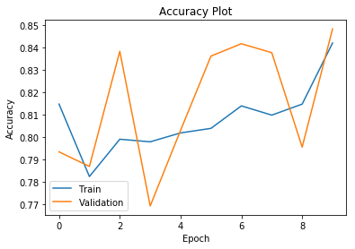


```python
plt.plot(perceptron_model_history.history['loss'])
plt.plot(perceptron_model_history.history['val_loss'])
plt.title('Loss Function Plot')
plt.ylabel('Loss')
plt.xlabel('Epoch')
plt.legend(['Train', 'Validation'])
plt.show()
```


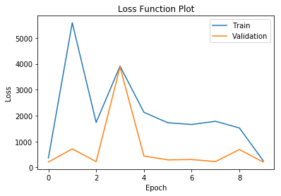


```python
# Get Model Summary:

print(perceptron_model.summary())
```

    Model: "sequential_1"
    _________________________________________________________________
    Layer (type)                 Output Shape              Param #   
    =================================================================
    dense_1 (Dense)              (None, 1)                 22        
    =================================================================
    Total params: 22
    Trainable params: 22
    Non-trainable params: 0
    _________________________________________________________________
    None


```python
# Vizualize the model:

from keras.utils.vis_utils import plot_model

plot_model(perceptron_model, to_file='perceptron_model.png', show_shapes=True, show_layer_names=True) # to_file='model_plot.png'
```


##### Predictions


```python
from sklearn.metrics import confusion_matrix
```


```python
test_pred = perceptron_model.predict_classes(X_test)
train_pred = perceptron_model.predict_classes(X_train)

confusion_matrix_test = confusion_matrix(y_test, test_pred)
confusion_matrix_train = confusion_matrix(y_train, train_pred)

print(confusion_matrix_train)
print(confusion_matrix_test)
```

    [[28967  3502]
     [ 2540  5064]]
    [[12445  1471]
     [ 1072  2187]]


##### Train Test Accuracy, True Negative Rate and True Positive Rate


```python
Accuracy_Train=(confusion_matrix_train[0,0]+confusion_matrix_train[1,1])/(confusion_matrix_train[0,0]+confusion_matrix_train[0,1]+confusion_matrix_train[1,0]+confusion_matrix_train[1,1])
TNR_Train= confusion_matrix_train[0,0]/(confusion_matrix_train[0,0]+confusion_matrix_train[0,1])
TPR_Train= confusion_matrix_train[1,1]/(confusion_matrix_train[1,0]+confusion_matrix_train[1,1])

print("Train TNR: ",TNR_Train)
print("Train TPR: ",TPR_Train)
print("Train Accuracy: ",Accuracy_Train)

print("-----------------------")

Accuracy_Test=(confusion_matrix_test[0,0]+confusion_matrix_test[1,1])/(confusion_matrix_test[0,0]+confusion_matrix_test[0,1]+confusion_matrix_test[1,0]+confusion_matrix_test[1,1])
TNR_Test= confusion_matrix_test[0,0]/(confusion_matrix_test[0,0] +confusion_matrix_test[0,1])
TPR_Test= confusion_matrix_test[1,1]/(confusion_matrix_test[1,0] +confusion_matrix_test[1,1])

print("Test TNR: ",TNR_Test)
print("Test TPR: ",TPR_Test)
print("Test Accuracy: ",Accuracy_Test)
```

    Train TNR:  0.8921432751239644
    Train TPR:  0.6659652814308259
    Train Accuracy:  0.8492251640755621
    -----------------------
    Test TNR:  0.8942943374532911
    Test TPR:  0.6710647437864375
    Test Accuracy:  0.8519359534206695


### MLP with 2 layers

    1 hidden layer with 15 neurons


```python
## MLP with 2 layers and 15 neurons:

# Define MLP model:

from keras import initializers

mlp_model_15 = Sequential()

mlp_model_15.add(Dense(15, input_dim=21, activation='tanh', kernel_initializer=initializers.RandomUniform(seed=123)))
mlp_model_15.add(Dense(1, activation='sigmoid'))
mlp_model_15.compile(loss='binary_crossentropy', optimizer='sgd', metrics=['accuracy'])


mlp_model_15_history = mlp_model_15.fit(X_train, y_train, epochs=10, batch_size=64,
                                        validation_split=0.2,use_multiprocessing=True)

## Plot:
print(mlp_model_15_history.history.keys())

## Accuracy:
plt.plot(mlp_model_15_history.history['accuracy'])
plt.plot(mlp_model_15_history.history['val_accuracy'])
plt.title('Accuracy Plot')
plt.ylabel('Accuracy')
plt.xlabel('Epoch')
plt.legend(['Train', 'Validation'])
plt.show()

## Loss:
plt.plot(mlp_model_15_history.history['loss'])
plt.plot(mlp_model_15_history.history['val_loss'])
plt.title('Loss Function Plot')
plt.ylabel('Loss')
plt.xlabel('Epoch')
plt.legend(['Train', 'Validation'])
plt.show()

# Get Model Summary:
print(mlp_model_15.summary())

# Vizualize the model:
from keras.utils.vis_utils import plot_model

plot_model(mlp_model_15, to_file='mlp_model_15.png', show_shapes=True, show_layer_names=True) # to_file='model_plot.png'

```

    Train on 32058 samples, validate on 8015 samples
    Epoch 1/10
    32058/32058 [==============================] - 1s 29us/step - loss: 0.3286 - accuracy: 0.8453 - val_loss: 0.3067 - val_accuracy: 0.8692
    Epoch 2/10
    32058/32058 [==============================] - 1s 26us/step - loss: 0.3048 - accuracy: 0.8586 - val_loss: 0.3157 - val_accuracy: 0.8143
    Epoch 3/10
    32058/32058 [==============================] - 1s 24us/step - loss: 0.2914 - accuracy: 0.8704 - val_loss: 0.2706 - val_accuracy: 0.8937
    Epoch 4/10
    32058/32058 [==============================] - 1s 24us/step - loss: 0.3036 - accuracy: 0.8719 - val_loss: 0.2932 - val_accuracy: 0.8883
    Epoch 5/10
    32058/32058 [==============================] - 1s 23us/step - loss: 0.2827 - accuracy: 0.8814 - val_loss: 0.2697 - val_accuracy: 0.8882
    Epoch 6/10
    32058/32058 [==============================] - 1s 22us/step - loss: 0.2863 - accuracy: 0.8737 - val_loss: 0.2857 - val_accuracy: 0.8719
    Epoch 7/10
    32058/32058 [==============================] - 1s 23us/step - loss: 0.2855 - accuracy: 0.8767 - val_loss: 0.2828 - val_accuracy: 0.8755
    Epoch 8/10
    32058/32058 [==============================] - 1s 22us/step - loss: 0.2942 - accuracy: 0.8625 - val_loss: 0.3059 - val_accuracy: 0.8870
    Epoch 9/10
    32058/32058 [==============================] - 1s 23us/step - loss: 0.3390 - accuracy: 0.8287 - val_loss: 0.2996 - val_accuracy: 0.8379
    Epoch 10/10
    32058/32058 [==============================] - 1s 23us/step - loss: 0.3055 - accuracy: 0.8570 - val_loss: 0.2910 - val_accuracy: 0.8826
    dict_keys(['val_loss', 'val_accuracy', 'loss', 'accuracy'])


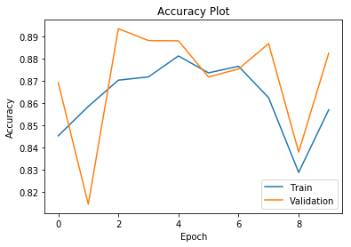


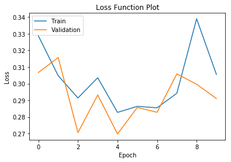


    Model: "sequential_2"
    _________________________________________________________________
    Layer (type)                 Output Shape              Param #   
    =================================================================
    dense_2 (Dense)              (None, 15)                330       
    _________________________________________________________________
    dense_3 (Dense)              (None, 1)                 16        
    =================================================================
    Total params: 346
    Trainable params: 346
    Non-trainable params: 0
    _________________________________________________________________
    None


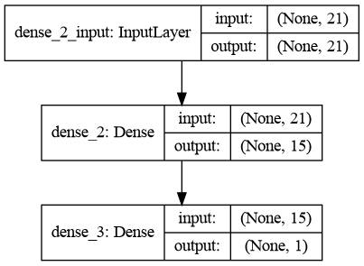


#### Predictions

#### Getting evaluation metrics and evaluating model performance

#### Calculate Accuracy, True Positive Rate and True Negative Rates


```python
#### Predictions

#### Getting evaluation metrics and evaluating model performance

mlp_test_pred_15 = mlp_model_15.predict_classes(X_test)
mlp_train_pred_15 = mlp_model_15.predict_classes(X_train)

mlp_confusion_matrix_test_15 = confusion_matrix(y_test, mlp_test_pred_15)
mlp_confusion_matrix_train_15 = confusion_matrix(y_train, mlp_train_pred_15)

print(mlp_confusion_matrix_train_15)
print(mlp_confusion_matrix_test_15)


#### Calculate Accuracy, True Positive Rate and True Negative Rates

##### Train Test Accuracy, True Negative Rate and True Positive Rate

mlp_Accuracy_Train_15=(mlp_confusion_matrix_train_15[0,0]+mlp_confusion_matrix_train_15[1,1])/(mlp_confusion_matrix_train_15[0,0]+mlp_confusion_matrix_train_15[0,1]+mlp_confusion_matrix_train_15[1,0]+mlp_confusion_matrix_train_15[1,1])
mlp_TNR_Train_15=mlp_confusion_matrix_train_15[0,0]/(mlp_confusion_matrix_train_15[0,0]+mlp_confusion_matrix_train_15[0,1])
mlp_TPR_Train_15=mlp_confusion_matrix_train_15[1,1]/(mlp_confusion_matrix_train_15[1,0]+mlp_confusion_matrix_train_15[1,1])

print("Train TNR: ",mlp_TNR_Train_15)
print("Train TPR: ",mlp_TPR_Train_15)
print("Train Accuracy: ",mlp_Accuracy_Train_15)

print("-----------------------")

mlp_Accuracy_Test_15=(mlp_confusion_matrix_test_15[0,0]+mlp_confusion_matrix_test_15[1,1])/(mlp_confusion_matrix_test_15[0,0]+mlp_confusion_matrix_test_15[0,1]+mlp_confusion_matrix_test_15[1,0]+mlp_confusion_matrix_test_15[1,1])
mlp_TNR_Test_15= mlp_confusion_matrix_test_15[0,0]/(mlp_confusion_matrix_test_15[0,0] + mlp_confusion_matrix_test_15[0,1])
mlp_TPR_Test_15= mlp_confusion_matrix_test_15[1,1]/(mlp_confusion_matrix_test_15[1,0] + mlp_confusion_matrix_test_15[1,1])

print("Test TNR: ",mlp_TNR_Test_15)
print("Test TPR: ",mlp_TPR_Test_15)
print("Test Accuracy: ",mlp_Accuracy_Test_15)
```

    [[29882  2587]
     [ 2176  5428]]
    [[12832  1084]
     [  947  2312]]
    Train TNR:  0.9203240013551387
    Train TPR:  0.7138348237769595
    Train Accuracy:  0.881141916003294
    -----------------------
    Test TNR:  0.9221040528887612
    Test TPR:  0.7094200675053698
    Test Accuracy:  0.8817467248908297


### MLP with 2 layers

    1 hidden layer with 20 neurons


```python
# Define MLP model:

from keras import initializers

mlp_model = Sequential()

mlp_model.add(Dense(20, input_dim=21, activation='relu', kernel_initializer=initializers.RandomUniform(seed=123)))
mlp_model.add(Dense(1, activation='sigmoid'))
mlp_model.compile(loss='binary_crossentropy', optimizer='sgd', metrics=['accuracy'])

```


```python
mlp_model_history = mlp_model.fit(X_train, y_train, epochs=10, batch_size=64, validation_split=0.2,
                                 use_multiprocessing=True)
```

    Train on 32058 samples, validate on 8015 samples
    Epoch 1/10
    32058/32058 [==============================] - 1s 25us/step - loss: 0.4687 - accuracy: 0.8102 - val_loss: 0.3916 - val_accuracy: 0.8070
    Epoch 2/10
    32058/32058 [==============================] - 1s 22us/step - loss: 3.8956 - accuracy: 0.8103 - val_loss: 0.3914 - val_accuracy: 0.8055
    Epoch 3/10
    32058/32058 [==============================] - 1s 23us/step - loss: 0.3872 - accuracy: 0.8114 - val_loss: 0.3967 - val_accuracy: 0.8054
    Epoch 4/10
    32058/32058 [==============================] - 1s 23us/step - loss: 0.3648 - accuracy: 0.8114 - val_loss: 0.3995 - val_accuracy: 0.8055
    Epoch 5/10
    32058/32058 [==============================] - 1s 23us/step - loss: 0.3828 - accuracy: 0.8115 - val_loss: 0.3910 - val_accuracy: 0.8054
    Epoch 6/10
    32058/32058 [==============================] - 1s 22us/step - loss: 0.3759 - accuracy: 0.8114 - val_loss: 0.3867 - val_accuracy: 0.8054
    Epoch 7/10
    32058/32058 [==============================] - 1s 22us/step - loss: 0.3696 - accuracy: 0.8114 - val_loss: 0.3775 - val_accuracy: 0.8055
    Epoch 8/10
    32058/32058 [==============================] - 1s 23us/step - loss: 0.4250 - accuracy: 0.8103 - val_loss: 0.3979 - val_accuracy: 0.8054
    Epoch 9/10
    32058/32058 [==============================] - 1s 23us/step - loss: 0.3804 - accuracy: 0.8114 - val_loss: 0.3878 - val_accuracy: 0.8055
    Epoch 10/10
    32058/32058 [==============================] - 1s 22us/step - loss: 0.4249 - accuracy: 0.8112 - val_loss: 0.4007 - val_accuracy: 0.8055


```python
## Plot:
print(mlp_model_history.history.keys())

## Accuracy:
plt.plot(mlp_model_history.history['accuracy'])
plt.plot(mlp_model_history.history['val_accuracy'])
plt.title('Accuracy Plot')
plt.ylabel('Accuracy')
plt.xlabel('Epoch')
plt.legend(['Train', 'Validation'])
plt.show()

## Loss:
plt.plot(mlp_model_history.history['loss'])
plt.plot(mlp_model_history.history['val_loss'])
plt.title('Loss Function Plot')
plt.ylabel('Loss')
plt.xlabel('Epoch')
plt.legend(['Train', 'Validation'])
plt.show()
```

    dict_keys(['val_loss', 'val_accuracy', 'loss', 'accuracy'])


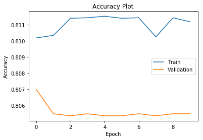


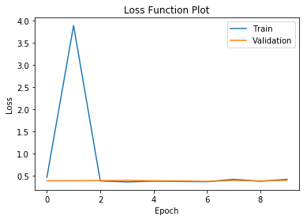


```python
# Get Model Summary:
print(mlp_model.summary())
```

    Model: "sequential_3"
    _________________________________________________________________
    Layer (type)                 Output Shape              Param #   
    =================================================================
    dense_4 (Dense)              (None, 20)                440       
    _________________________________________________________________
    dense_5 (Dense)              (None, 1)                 21        
    =================================================================
    Total params: 461
    Trainable params: 461
    Non-trainable params: 0
    _________________________________________________________________
    None


```python
# Vizualize the model:
from keras.utils.vis_utils import plot_model

plot_model(mlp_model, to_file='mlp_model.png', show_shapes=True, show_layer_names=True) # to_file='model_plot.png'
```


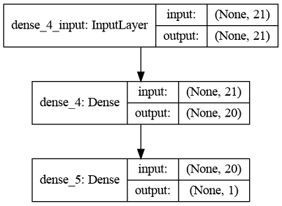


#### Predictions

#### Getting evaluation metrics and evaluating model performance


```python
mlp_test_pred = mlp_model.predict_classes(X_test)
mlp_train_pred = mlp_model.predict_classes(X_train)

mlp_confusion_matrix_test = confusion_matrix(y_test, mlp_test_pred)
mlp_confusion_matrix_train = confusion_matrix(y_train, mlp_train_pred)

print(mlp_confusion_matrix_train)
print(mlp_confusion_matrix_test)

```

    [[32468     1]
     [ 7602     2]]
    [[13916     0]
     [ 3259     0]]


#### Calculate Accuracy, True Positive Rate and True Negative Rates


```python
##### Train Test Accuracy, True Negative Rate and True Positive Rate

mlp_Accuracy_Train=(mlp_confusion_matrix_train[0,0]+mlp_confusion_matrix_train[1,1])/(mlp_confusion_matrix_train[0,0]+mlp_confusion_matrix_train[0,1]+mlp_confusion_matrix_train[1,0]+mlp_confusion_matrix_train[1,1])
mlp_TNR_Train=mlp_confusion_matrix_train[0,0]/(mlp_confusion_matrix_train[0,0]+mlp_confusion_matrix_train[0,1])
mlp_TPR_Train=mlp_confusion_matrix_train[1,1]/(mlp_confusion_matrix_train[1,0]+mlp_confusion_matrix_train[1,1])

print("Train TNR: ",mlp_TNR_Train)
print("Train TPR: ",mlp_TPR_Train)
print("Train Accuracy: ",mlp_Accuracy_Train)

print("-----------------------")

mlp_Accuracy_Test=(mlp_confusion_matrix_test[0,0]+mlp_confusion_matrix_test[1,1])/(mlp_confusion_matrix_test[0,0]+mlp_confusion_matrix_test[0,1]+mlp_confusion_matrix_test[1,0]+mlp_confusion_matrix_test[1,1])
mlp_TNR_Test= mlp_confusion_matrix_test[0,0]/(mlp_confusion_matrix_test[0,0] + mlp_confusion_matrix_test[0,1])
mlp_TPR_Test= mlp_confusion_matrix_test[1,1]/(mlp_confusion_matrix_test[1,0] + mlp_confusion_matrix_test[1,1])

print("Test TNR: ",mlp_TNR_Test)
print("Test TPR: ",mlp_TPR_Test)
print("Test Accuracy: ",mlp_Accuracy_Test)
```

    Train TNR:  0.9999692013920971
    Train TPR:  0.0002630194634402946
    Train Accuracy:  0.8102712549596985
    -----------------------
    Test TNR:  1.0
    Test TPR:  0.0
    Test Accuracy:  0.8102474526928676


### MLP with 2 layers

    1 hidden layer with 25 neurons


```python
mlp25 = Sequential()

mlp25.add(Dense(25, input_dim=21, activation='sigmoid', kernel_initializer=initializers.RandomUniform(seed=351)))
mlp25.add(Dense(1, activation='sigmoid'))
mlp25.compile(loss='binary_crossentropy', optimizer='sgd', metrics=['accuracy'])
```


```python
mlp25_hist = mlp25.fit(X_train, y_train, epochs=10, batch_size=64, validation_split=0.2,
                      use_multiprocessing=True, shuffle=True)
```

    Train on 32058 samples, validate on 8015 samples
    Epoch 1/10
    32058/32058 [==============================] - 1s 25us/step - loss: 0.3544 - accuracy: 0.8331 - val_loss: 0.3157 - val_accuracy: 0.8586
    Epoch 2/10
    32058/32058 [==============================] - 1s 23us/step - loss: 0.2985 - accuracy: 0.8683 - val_loss: 0.2921 - val_accuracy: 0.8791
    Epoch 3/10
    32058/32058 [==============================] - 1s 22us/step - loss: 0.2847 - accuracy: 0.8775 - val_loss: 0.2913 - val_accuracy: 0.8751
    Epoch 4/10
    32058/32058 [==============================] - 1s 22us/step - loss: 0.2797 - accuracy: 0.8826 - val_loss: 0.2765 - val_accuracy: 0.8896
    Epoch 5/10
    32058/32058 [==============================] - 1s 22us/step - loss: 0.2777 - accuracy: 0.8841 - val_loss: 0.2850 - val_accuracy: 0.8837
    Epoch 6/10
    32058/32058 [==============================] - 1s 22us/step - loss: 0.2778 - accuracy: 0.8851 - val_loss: 0.2883 - val_accuracy: 0.8705
    Epoch 7/10
    32058/32058 [==============================] - 1s 22us/step - loss: 0.2703 - accuracy: 0.8866 - val_loss: 0.2748 - val_accuracy: 0.8910
    Epoch 8/10
    32058/32058 [==============================] - 1s 23us/step - loss: 0.2703 - accuracy: 0.8883 - val_loss: 0.2791 - val_accuracy: 0.8847
    Epoch 9/10
    32058/32058 [==============================] - 1s 23us/step - loss: 0.2694 - accuracy: 0.8894 - val_loss: 0.2670 - val_accuracy: 0.8878
    Epoch 10/10
    32058/32058 [==============================] - 1s 23us/step - loss: 0.2659 - accuracy: 0.8921 - val_loss: 0.2673 - val_accuracy: 0.8885


```python
## Plot:

print(mlp25_hist.history.keys())

## Accuracy:

plt.plot(mlp25_hist.history['accuracy'])
plt.plot(mlp25_hist.history['val_accuracy'])
plt.title('Accuracy Plot')
plt.ylabel('Accuracy')
plt.xlabel('Epoch')
plt.legend(['Train','Validation'])
plt.show()

## Loss:

plt.plot(mlp25_hist.history['loss'])
plt.plot(mlp25_hist.history['val_loss'])
plt.title('Loss Function Plot')
plt.ylabel('Loss')
plt.xlabel('Epoch')
plt.legend(['Train','Validation'])
plt.show()
```

    dict_keys(['val_loss', 'val_accuracy', 'loss', 'accuracy'])


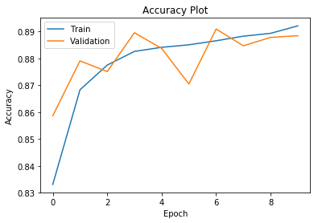


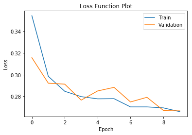


```python
mlp25.summary()
```

    Model: "sequential_4"
    _________________________________________________________________
    Layer (type)                 Output Shape              Param #   
    =================================================================
    dense_6 (Dense)              (None, 25)                550       
    _________________________________________________________________
    dense_7 (Dense)              (None, 1)                 26        
    =================================================================
    Total params: 576
    Trainable params: 576
    Non-trainable params: 0
    _________________________________________________________________


```python
plot_model(mlp25, to_file="MLP_25_Neuron.png", show_layer_names=True, show_shapes=True)
```


#### Predictions

#### Getting evaluation metrics and evaluating model performance


```python
mlp25_test_pred = mlp25.predict_classes(X_test)
mlp25_train_pred = mlp25.predict_classes(X_train)

mlp25_confusion_matrix_test = confusion_matrix(y_test, mlp25_test_pred)
mlp25_confusion_matrix_train = confusion_matrix(y_train, mlp25_train_pred)

print("Confusion Matrix for Train Data:")
print(mlp25_confusion_matrix_train)
print("Confusion Matrix for Test Data:")
print(mlp25_confusion_matrix_test)

```

    Confusion Matrix for Train Data:
    [[30825  1644]
     [ 2771  4833]]
    Confusion Matrix for Test Data:
    [[13242   674]
     [ 1194  2065]]


#### Calculate Accuracy, True Positive Rate and True Negative Rates

Observation:

    Based on the TPR, 2 layer MLP with 25 nodes hidden layer is best


```python
##### Train Test Accuracy, True Negative Rate and True Positive Rate

mlp25_Accuracy_Train = (mlp25_confusion_matrix_train[0,0]+
                        mlp25_confusion_matrix_train[1,1])/(
                        mlp25_confusion_matrix_train[0,0]+
                        mlp25_confusion_matrix_train[0,1]+
                        mlp25_confusion_matrix_train[1,0]+
                        mlp25_confusion_matrix_train[1,1])
    
mlp25_TNR_Train = mlp25_confusion_matrix_train[0,0]/(
                    mlp25_confusion_matrix_train[0,0]+
                    mlp25_confusion_matrix_train[0,1])

mlp25_TPR_Train = mlp25_confusion_matrix_train[1,1]/(
                    mlp25_confusion_matrix_train[1,0]+
                    mlp25_confusion_matrix_train[1,1])

print("Train TNR: ",mlp25_TNR_Train)
print("Train TPR: ",mlp25_TPR_Train)
print("Train Accuracy: ",mlp25_Accuracy_Train)

print("-----------------------")

mlp25_Accuracy_Test = (mlp25_confusion_matrix_test[0,0]+
                        mlp25_confusion_matrix_test[1,1])/(
                        mlp25_confusion_matrix_test[0,0]+
                        mlp25_confusion_matrix_test[0,1]+
                        mlp25_confusion_matrix_test[1,0]+
                        mlp25_confusion_matrix_test[1,1])
    
mlp25_TNR_Test = mlp25_confusion_matrix_test[0,0]/(
                    mlp25_confusion_matrix_test[0,0]+
                    mlp25_confusion_matrix_test[0,1])

mlp25_TPR_Test = mlp25_confusion_matrix_test[1,1]/(
                    mlp25_confusion_matrix_test[1,0]+
                    mlp25_confusion_matrix_test[1,1])

print("Test TNR: ",mlp25_TNR_Test)
print("Test TPR: ",mlp25_TPR_Test)
print("Test Accuracy: ",mlp25_Accuracy_Test)

```

    Train TNR:  0.9493670886075949
    Train TPR:  0.6355865334034718
    Train Accuracy:  0.8898260674269458
    -----------------------
    Test TNR:  0.9515665421098016
    Test TPR:  0.6336299478367597
    Test Accuracy:  0.8912372634643377


### MLP with 3 layers

    1st hidden layer with 25 neurons
    2nd hidden layer with 15 neurons


```python
## MLP with 3 layers: 25 & 15 neurons:

# Define MLP model:

from keras import initializers
from keras.layers.advanced_activations import LeakyReLU

mlp_model_3 = Sequential()
mlp_model_3.add(Dense(25, input_dim=21, activation='relu', kernel_initializer=initializers.RandomUniform(seed=351)))
mlp_model_3.add(Dense(15))
mlp_model_3.add(LeakyReLU(alpha=0.09))
mlp_model_3.add(Dense(1, activation='sigmoid'))
mlp_model_3.compile(loss='binary_crossentropy', optimizer='adam', metrics=['accuracy'])


mlp_model_3_history = mlp_model_3.fit(X_train, y_train, epochs=10, batch_size=64, validation_split=0.2, use_multiprocessing=True)

```

    Train on 32058 samples, validate on 8015 samples
    Epoch 1/10
    32058/32058 [==============================] - 1s 30us/step - loss: 1.5740 - accuracy: 0.8286 - val_loss: 0.9273 - val_accuracy: 0.8432
    Epoch 2/10
    32058/32058 [==============================] - 1s 25us/step - loss: 0.6344 - accuracy: 0.8639 - val_loss: 0.3866 - val_accuracy: 0.8818
    Epoch 3/10
    32058/32058 [==============================] - 1s 25us/step - loss: 0.5644 - accuracy: 0.8735 - val_loss: 0.5795 - val_accuracy: 0.8802
    Epoch 4/10
    32058/32058 [==============================] - 1s 25us/step - loss: 0.7105 - accuracy: 0.8692 - val_loss: 0.9374 - val_accuracy: 0.8564
    Epoch 5/10
    32058/32058 [==============================] - 1s 27us/step - loss: 0.4884 - accuracy: 0.8728 - val_loss: 0.9982 - val_accuracy: 0.8791
    Epoch 6/10
    32058/32058 [==============================] - 1s 26us/step - loss: 0.4278 - accuracy: 0.8770 - val_loss: 0.3677 - val_accuracy: 0.8806
    Epoch 7/10
    32058/32058 [==============================] - 1s 27us/step - loss: 0.4238 - accuracy: 0.8764 - val_loss: 1.3770 - val_accuracy: 0.8599
    Epoch 8/10
    32058/32058 [==============================] - 1s 25us/step - loss: 0.6351 - accuracy: 0.8682 - val_loss: 0.3226 - val_accuracy: 0.8774
    Epoch 9/10
    32058/32058 [==============================] - 1s 28us/step - loss: 0.4247 - accuracy: 0.8783 - val_loss: 0.8005 - val_accuracy: 0.8707
    Epoch 10/10
    32058/32058 [==============================] - 1s 26us/step - loss: 0.7918 - accuracy: 0.8630 - val_loss: 0.3556 - val_accuracy: 0.8780


```python
## Plot:
print(mlp_model_3_history.history.keys())

## Accuracy:
plt.plot(mlp_model_3_history.history['accuracy'])
plt.plot(mlp_model_3_history.history['val_accuracy'])
plt.title('Accuracy Plot')
plt.ylabel('Accuracy')
plt.xlabel('Epoch')
plt.legend(['Train', 'Validation'])
plt.show()

## Loss:
plt.plot(mlp_model_3_history.history['loss'])
plt.plot(mlp_model_3_history.history['val_loss'])
plt.title('Loss Function Plot')
plt.ylabel('Loss')
plt.xlabel('Epoch')
plt.legend(['Train', 'Validation'])
plt.show()

# Get Model Summary:
print(mlp_model_3.summary())

# Vizualize the model:
from keras.utils.vis_utils import plot_model

plot_model(mlp_model_3, to_file='mlp_model_3.png', show_shapes=True, show_layer_names=True) # to_file='model_plot.png'

```

    dict_keys(['val_loss', 'val_accuracy', 'loss', 'accuracy'])


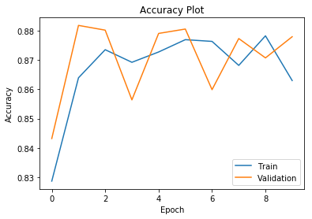


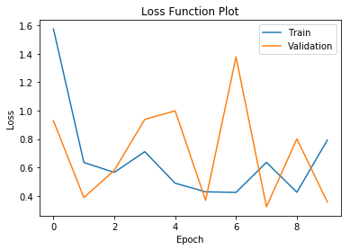


    Model: "sequential_5"
    _________________________________________________________________
    Layer (type)                 Output Shape              Param #   
    =================================================================
    dense_8 (Dense)              (None, 25)                550       
    _________________________________________________________________
    dense_9 (Dense)              (None, 15)                390       
    _________________________________________________________________
    leaky_re_lu_1 (LeakyReLU)    (None, 15)                0         
    _________________________________________________________________
    dense_10 (Dense)             (None, 1)                 16        
    =================================================================
    Total params: 956
    Trainable params: 956
    Non-trainable params: 0
    _________________________________________________________________
    None


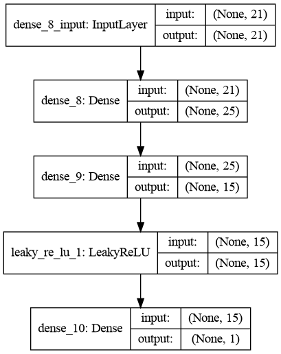


#### Predictions

#### Getting evaluation metrics and evaluating model performance

#### Calculate Accuracy, True Positive Rate and True Negative Rates

Observation:

    Based on the TPR: 3 layer mlp, with 25 nodes in hidden layer 1 and 15 nodes in hidden layer 2 is the best 


```python
#### Predictions

#### Getting evaluation metrics and evaluating model performance

mlp_test_pred_3 = mlp_model_3.predict_classes(X_test)
mlp_train_pred_3 = mlp_model_3.predict_classes(X_train)

mlp_confusion_matrix_test_3 = confusion_matrix(y_test, mlp_test_pred_3)
mlp_confusion_matrix_train_3 = confusion_matrix(y_train, mlp_train_pred_3)

print(mlp_confusion_matrix_train_3)
print(mlp_confusion_matrix_test_3)


#### Calculate Accuracy, True Positive Rate and True Negative Rates

##### Train Test Accuracy, True Negative Rate and True Positive Rate

mlp_Accuracy_Train_3=(mlp_confusion_matrix_train_3[0,0]+mlp_confusion_matrix_train_3[1,1])/(mlp_confusion_matrix_train_3[0,0]+mlp_confusion_matrix_train_3[0,1]+mlp_confusion_matrix_train_3[1,0]+mlp_confusion_matrix_train_3[1,1])
mlp_TNR_Train_3=mlp_confusion_matrix_train_3[0,0]/(mlp_confusion_matrix_train_3[0,0]+mlp_confusion_matrix_train_3[0,1])
mlp_TPR_Train_3=mlp_confusion_matrix_train_3[1,1]/(mlp_confusion_matrix_train_3[1,0]+mlp_confusion_matrix_train_3[1,1])

print("Train TNR: ",mlp_TNR_Train_3)
print("Train TPR: ",mlp_TPR_Train_3)
print("Train Accuracy: ",mlp_Accuracy_Train_3)

print("-----------------------")

mlp_Accuracy_Test_3=(mlp_confusion_matrix_test_3[0,0]+mlp_confusion_matrix_test_3[1,1])/(mlp_confusion_matrix_test_3[0,0]+mlp_confusion_matrix_test_3[0,1]+mlp_confusion_matrix_test_3[1,0]+mlp_confusion_matrix_test_3[1,1])
mlp_TNR_Test_3= mlp_confusion_matrix_test_3[0,0]/(mlp_confusion_matrix_test_3[0,0] + mlp_confusion_matrix_test_3[0,1])
mlp_TPR_Test_3= mlp_confusion_matrix_test_3[1,1]/(mlp_confusion_matrix_test_3[1,0] + mlp_confusion_matrix_test_3[1,1])

print("Test TNR: ",mlp_TNR_Test_3)
print("Test TPR: ",mlp_TPR_Test_3)
print("Test Accuracy: ",mlp_Accuracy_Test_3)
```

    [[30428  2041]
     [ 2866  4738]]
    [[13068   848]
     [ 1207  2052]]
    Train TNR:  0.9371400412701346
    Train TPR:  0.6230931088900579
    Train Accuracy:  0.8775484740348863
    -----------------------
    Test TNR:  0.9390629491233113
    Test TPR:  0.6296409941699908
    Test Accuracy:  0.880349344978166


### MLP with 3 layers

    1st hidden layer with 25 neurons
    2nd hidden layer with 20 neurons


```python
## MLP with 3 layers: 25 & 20 neurons:

# Define MLP model:

from keras import initializers
from keras.layers.advanced_activations import LeakyReLU

mlp_model_25_20 = Sequential()
mlp_model_25_20.add(Dense(25, input_dim=21, activation='relu', kernel_initializer=initializers.RandomUniform(seed=351)))
mlp_model_25_20.add(Dense(20))
mlp_model_25_20.add(LeakyReLU(alpha=0.09))
mlp_model_25_20.add(Dense(1, activation='sigmoid'))
mlp_model_25_20.compile(loss='binary_crossentropy', optimizer='adam', metrics=['accuracy'])


mlp_model_25_20_history = mlp_model_25_20.fit(X_train, y_train, epochs=10, batch_size=64, validation_split=0.2, use_multiprocessing=True)

```

    Train on 32058 samples, validate on 8015 samples
    Epoch 1/10
    32058/32058 [==============================] - 1s 40us/step - loss: 0.5041 - accuracy: 0.8540 - val_loss: 0.3993 - val_accuracy: 0.8755
    Epoch 2/10
    32058/32058 [==============================] - 1s 33us/step - loss: 0.5029 - accuracy: 0.8642 - val_loss: 0.6029 - val_accuracy: 0.8625
    Epoch 3/10
    32058/32058 [==============================] - 1s 33us/step - loss: 0.4593 - accuracy: 0.8693 - val_loss: 0.3816 - val_accuracy: 0.8818
    Epoch 4/10
    32058/32058 [==============================] - 1s 32us/step - loss: 0.4076 - accuracy: 0.8696 - val_loss: 0.3120 - val_accuracy: 0.8911
    Epoch 5/10
    32058/32058 [==============================] - 1s 33us/step - loss: 0.3353 - accuracy: 0.8767 - val_loss: 0.3687 - val_accuracy: 0.8866
    Epoch 6/10
    32058/32058 [==============================] - 1s 27us/step - loss: 0.4282 - accuracy: 0.8838 - val_loss: 0.3276 - val_accuracy: 0.8913
    Epoch 7/10
    32058/32058 [==============================] - 1s 26us/step - loss: 0.4500 - accuracy: 0.8783 - val_loss: 0.6216 - val_accuracy: 0.8830
    Epoch 8/10
    32058/32058 [==============================] - 1s 26us/step - loss: 0.5726 - accuracy: 0.8739 - val_loss: 0.3695 - val_accuracy: 0.8933
    Epoch 9/10
    32058/32058 [==============================] - 1s 30us/step - loss: 0.3601 - accuracy: 0.8869 - val_loss: 0.3291 - val_accuracy: 0.8928
    Epoch 10/10
    32058/32058 [==============================] - 1s 34us/step - loss: 0.2962 - accuracy: 0.8925 - val_loss: 0.3013 - val_accuracy: 0.8897


```python
## Plot:
print(mlp_model_25_20_history.history.keys())

## Accuracy:
plt.plot(mlp_model_25_20_history.history['accuracy'])
plt.plot(mlp_model_25_20_history.history['val_accuracy'])
plt.title('Accuracy Plot')
plt.ylabel('Accuracy')
plt.xlabel('Epoch')
plt.legend(['Train', 'Validation'])
plt.show()

## Loss:
plt.plot(mlp_model_25_20_history.history['loss'])
plt.plot(mlp_model_25_20_history.history['val_loss'])
plt.title('Loss Function Plot')
plt.ylabel('Loss')
plt.xlabel('Epoch')
plt.legend(['Train', 'Validation'])
plt.show()

# Get Model Summary:
print(mlp_model_25_20.summary())

# Vizualize the model:
from keras.utils.vis_utils import plot_model

plot_model(mlp_model_25_20, to_file='mlp_model_20_25.png', show_shapes=True, show_layer_names=True) # to_file='model_plot.png'

```

    dict_keys(['val_loss', 'val_accuracy', 'loss', 'accuracy'])


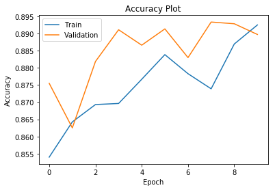


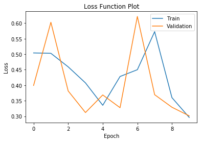


    Model: "sequential_6"
    _________________________________________________________________
    Layer (type)                 Output Shape              Param #   
    =================================================================
    dense_11 (Dense)             (None, 25)                550       
    _________________________________________________________________
    dense_12 (Dense)             (None, 20)                520       
    _________________________________________________________________
    leaky_re_lu_2 (LeakyReLU)    (None, 20)                0         
    _________________________________________________________________
    dense_13 (Dense)             (None, 1)                 21        
    =================================================================
    Total params: 1,091
    Trainable params: 1,091
    Non-trainable params: 0
    _________________________________________________________________
    None


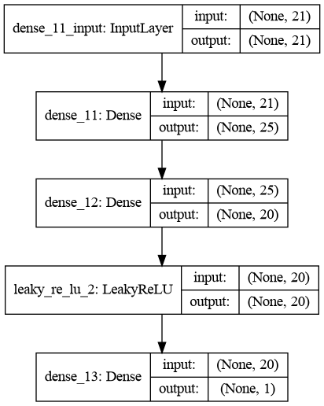


#### Predictions

#### Getting evaluation metrics and evaluating model performance

#### Calculate Accuracy, True Positive Rate and True Negative Rates


```python
#### Predictions

#### Getting evaluation metrics and evaluating model performance

mlp_test_pred_25_20 = mlp_model_25_20.predict_classes(X_test)
mlp_train_pred_25_20 = mlp_model_25_20.predict_classes(X_train)

mlp_confusion_matrix_test_25_20 = confusion_matrix(y_test, mlp_test_pred_25_20)
mlp_confusion_matrix_train_25_20 = confusion_matrix(y_train, mlp_train_pred_25_20)

print(mlp_confusion_matrix_train_25_20)
print(mlp_confusion_matrix_test_25_20)


#### Calculate Accuracy, True Positive Rate and True Negative Rates

##### Train Test Accuracy, True Negative Rate and True Positive Rate

mlp_Accuracy_Train_25_20=(mlp_confusion_matrix_train_25_20[0,0]+mlp_confusion_matrix_train_25_20[1,1])/(mlp_confusion_matrix_train_25_20[0,0]+mlp_confusion_matrix_train_25_20[0,1]+mlp_confusion_matrix_train_25_20[1,0]+mlp_confusion_matrix_train_25_20[1,1])
mlp_TNR_Train_25_20=mlp_confusion_matrix_train_25_20[0,0]/(mlp_confusion_matrix_train_25_20[0,0]+mlp_confusion_matrix_train_25_20[0,1])
mlp_TPR_Train_25_20=mlp_confusion_matrix_train_25_20[1,1]/(mlp_confusion_matrix_train_25_20[1,0]+mlp_confusion_matrix_train_25_20[1,1])

print("Train TNR: ",mlp_TNR_Train_25_20)
print("Train TPR: ",mlp_TPR_Train_25_20)
print("Train Accuracy: ",mlp_Accuracy_Train_25_20)

print("-----------------------")

mlp_Accuracy_Test_25_20=(mlp_confusion_matrix_test_25_20[0,0]+mlp_confusion_matrix_test_25_20[1,1])/(mlp_confusion_matrix_test_25_20[0,0]+mlp_confusion_matrix_test_25_20[0,1]+mlp_confusion_matrix_test_25_20[1,0]+mlp_confusion_matrix_test_25_20[1,1])
mlp_TNR_Test_25_20= mlp_confusion_matrix_test_25_20[0,0]/(mlp_confusion_matrix_test_25_20[0,0] + mlp_confusion_matrix_test_25_20[0,1])
mlp_TPR_Test_25_20= mlp_confusion_matrix_test_25_20[1,1]/(mlp_confusion_matrix_test_25_20[1,0] + mlp_confusion_matrix_test_25_20[1,1])

print("Test TNR: ",mlp_TNR_Test_25_20)
print("Test TPR: ",mlp_TPR_Test_25_20)
print("Test Accuracy: ",mlp_Accuracy_Test_25_20)
```

    [[30983  1486]
     [ 2901  4703]]
    [[13323   593]
     [ 1235  2024]]
    Train TNR:  0.9542332686562567
    Train TPR:  0.6184902682798528
    Train Accuracy:  0.8905247922541362
    -----------------------
    Test TNR:  0.9573871802242023
    Test TPR:  0.62104940165695
    Test Accuracy:  0.893566229985444


```python
#np.logspace(0.0001,1,8, base=0.5)
#np.logspace(-3,-1,8)
#np.exp(-3)
tpr=[TPR_Test,mlp_TPR_Test_15,mlp_TPR_Test,
     mlp25_TPR_Test,mlp_TPR_Test_3, mlp_TPR_Test_25_20]
print(tpr)
print()

tnr=[TNR_Test,mlp_TNR_Test_15,mlp_TNR_Test,
     mlp25_TNR_Test,mlp_TNR_Test_3, mlp_TNR_Test_25_20]
print(tnr)
print()

models_l = ['Perceptron','MLP_15_neurons','MLP_20_neurons',
            'MLP_25_neurons','MLP_25_15_neurons','MLP_25_20_neurons']

accuracy=[Accuracy_Test, mlp_Accuracy_Test_15,
         mlp_Accuracy_Test, mlp25_Accuracy_Test,
         mlp_Accuracy_Test_3, mlp_Accuracy_Test_25_20]
print(accuracy)

```

    [0.6710647437864375, 0.7094200675053698, 0.0, 0.6336299478367597, 0.6296409941699908, 0.62104940165695]
    
    [0.8942943374532911, 0.9221040528887612, 1.0, 0.9515665421098016, 0.9390629491233113, 0.9573871802242023]
    
    [0.8519359534206695, 0.8817467248908297, 0.8102474526928676, 0.8912372634643377, 0.880349344978166, 0.893566229985444]


```python
best_model = pd.DataFrame(list(zip(models_l, accuracy, tpr, tnr)), 
             columns=(['Model_type','Accuracy','TPR','TNR']))

```


```python
best_model
```


<div>
<style scoped>
    .dataframe tbody tr th:only-of-type {
        vertical-align: middle;
    }

    .dataframe tbody tr th {
        vertical-align: top;
    }

    .dataframe thead th {
        text-align: right;
    }
</style>
<table border="1" class="dataframe">
  <thead>
    <tr style="text-align: right;">
      <th></th>
      <th>Model_type</th>
      <th>Accuracy</th>
      <th>TPR</th>
      <th>TNR</th>
    </tr>
  </thead>
  <tbody>
    <tr>
      <th>0</th>
      <td>Perceptron</td>
      <td>0.851936</td>
      <td>0.671065</td>
      <td>0.894294</td>
    </tr>
    <tr>
      <th>1</th>
      <td>MLP_15_neurons</td>
      <td>0.881747</td>
      <td>0.709420</td>
      <td>0.922104</td>
    </tr>
    <tr>
      <th>2</th>
      <td>MLP_20_neurons</td>
      <td>0.810247</td>
      <td>0.000000</td>
      <td>1.000000</td>
    </tr>
    <tr>
      <th>3</th>
      <td>MLP_25_neurons</td>
      <td>0.891237</td>
      <td>0.633630</td>
      <td>0.951567</td>
    </tr>
    <tr>
      <th>4</th>
      <td>MLP_25_15_neurons</td>
      <td>0.880349</td>
      <td>0.629641</td>
      <td>0.939063</td>
    </tr>
    <tr>
      <th>5</th>
      <td>MLP_25_20_neurons</td>
      <td>0.893566</td>
      <td>0.621049</td>
      <td>0.957387</td>
    </tr>
  </tbody>
</table>
</div>


```python
best_tpr_v = best_model.sort_values('TPR',ascending=False).reset_index().drop('index',axis=1).iloc[0][0]
```


```python
best_tpr_v
```


    'MLP_15_neurons'


```python
print("Observation:")
print("Based on the TPR, following model is the best: "+best_tpr_v)

```

    Observation:
    Based on the TPR, following model is the best: MLP_15_neurons


## Find best parameter

### Find the best Learning rate

    Using logarithmic scale randomly generate values between 0.0001 to 1 


```python
#l_rate = np.logspace(0.0001,1,8)
#l_rate = 10**(-2.3 * np.random.rand(6))
l_rate = np.logspace(-3,-1,8)
l_rate

```


    array([0.001     , 0.0019307 , 0.00372759, 0.00719686, 0.01389495,
           0.02682696, 0.05179475, 0.1       ])


```python
from keras.optimizers import Adam, SGD
from sklearn.model_selection import GridSearchCV
```


```python
def tune_l_rate(l_rate=0.01):
    
    # Create a model:
    ['Perceptron','MLP_15_neurons','MLP_20_neurons',
            'MLP_25_neurons','MLP_25_15_neurons','MLP_25_20_neurons']
    
    if best_tpr_v=='Perceptron':
        tuned_model = Sequential()
        tuned_model.add(Dense(1, input_dim=21, activation='sigmoid', kernel_initializer='normal'))
        optimizer = SGD(lr=l_rate)
    
    elif best_tpr_v=='MLP_15_neurons':
        tuned_model = Sequential()
        tuned_model.add(Dense(15, input_dim=21, activation='tanh', kernel_initializer=initializers.RandomUniform(seed=123)))
        tuned_model.add(Dense(1, activation='sigmoid'))
        optimizer = SGD(lr=l_rate)

    elif best_tpr_v=='MLP_20_neurons':
        tuned_model = Sequential()
        tuned_model.add(Dense(20, input_dim=21, activation='relu', kernel_initializer=initializers.RandomUniform(seed=123)))
        tuned_model.add(Dense(1, activation='sigmoid'))
        optimizer = SGD(lr=l_rate)
        
    elif best_tpr_v=='MLP_25_neurons':
        tuned_model = Sequential()
        tuned_model.add(Dense(25, input_dim=21, activation='sigmoid', kernel_initializer=initializers.RandomUniform(seed=351)))
        tuned_model.add(Dense(1, activation='sigmoid'))
        optimizer = SGD(lr=l_rate)
        
    elif best_tpr_v=='MLP_25_15_neurons':
        tuned_model = Sequential()
        tuned_model.add(Dense(25, input_dim=21, activation='relu', kernel_initializer=initializers.RandomUniform(seed=351)))
        tuned_model.add(Dense(15))
        tuned_model.add(LeakyReLU(alpha=0.09))
        tuned_model.add(Dense(1, activation='sigmoid'))
        optimizer = Adam(lr=l_rate)

    elif best_tpr_v=='MLP_25_20_neurons':
        tuned_model = Sequential()
        tuned_model.add(Dense(25, input_dim=21, activation='relu', kernel_initializer=initializers.RandomUniform(seed=351)))
        tuned_model.add(Dense(20))
        tuned_model.add(LeakyReLU(alpha=0.09))
        tuned_model.add(Dense(1, activation='sigmoid'))
        optimizer = Adam(lr=l_rate)
    
    # Compile Model:
    tuned_model.compile(loss='binary_crossentropy', optimizer=optimizer, metrics=['accuracy'])

    return tuned_model

```


```python
hist_loss=[]
hist_acc=[]

for l_rate_v in l_rate:
    
    tuned_model = tune_l_rate(l_rate_v)
    
    #Fit the model
    tuned_model_history = tuned_model.fit(X_train, y_train, epochs=1,
                                       batch_size=64, validation_split=0.2,
                                       use_multiprocessing=True)

    
    hist_loss.append(tuned_model_history.history['val_loss'])
    hist_acc.append(tuned_model_history.history['val_accuracy'])
```

    Train on 32058 samples, validate on 8015 samples
    Epoch 1/1
    32058/32058 [==============================] - 1s 25us/step - loss: 0.3355 - accuracy: 0.8545 - val_loss: 0.2934 - val_accuracy: 0.8803
    Train on 32058 samples, validate on 8015 samples
    Epoch 1/1
    32058/32058 [==============================] - 1s 26us/step - loss: 0.3288 - accuracy: 0.8490 - val_loss: 0.2946 - val_accuracy: 0.8711
    Train on 32058 samples, validate on 8015 samples
    Epoch 1/1
    32058/32058 [==============================] - 1s 24us/step - loss: 0.3270 - accuracy: 0.8533 - val_loss: 0.2972 - val_accuracy: 0.8740
    Train on 32058 samples, validate on 8015 samples
    Epoch 1/1
    32058/32058 [==============================] - 1s 25us/step - loss: 0.3170 - accuracy: 0.8534 - val_loss: 0.2850 - val_accuracy: 0.8857
    Train on 32058 samples, validate on 8015 samples
    Epoch 1/1
    32058/32058 [==============================] - 1s 36us/step - loss: 0.3235 - accuracy: 0.8412 - val_loss: 0.2939 - val_accuracy: 0.8816
    Train on 32058 samples, validate on 8015 samples
    Epoch 1/1
    32058/32058 [==============================] - 1s 23us/step - loss: 0.3375 - accuracy: 0.8315 - val_loss: 0.3347 - val_accuracy: 0.8187
    Train on 32058 samples, validate on 8015 samples
    Epoch 1/1
    32058/32058 [==============================] - 1s 24us/step - loss: 0.3374 - accuracy: 0.8293 - val_loss: 0.3045 - val_accuracy: 0.8653
    Train on 32058 samples, validate on 8015 samples
    Epoch 1/1
    32058/32058 [==============================] - 1s 23us/step - loss: 0.3287 - accuracy: 0.8359 - val_loss: 0.4337 - val_accuracy: 0.8061


```python
# Get the Learning rate and loss Dataframe
loss_l_rate = pd.DataFrame([l_rate, hist_loss, hist_acc]).T  

#Give the coloumn names
loss_l_rate.columns=['l_rate','val_loss','val_accuracy']

#Sort the values and reset the index
loss_l_rate=loss_l_rate.sort_values('val_loss').reset_index().drop('index',axis=1)
loss_l_rate
```


<div>
<style scoped>
    .dataframe tbody tr th:only-of-type {
        vertical-align: middle;
    }

    .dataframe tbody tr th {
        vertical-align: top;
    }

    .dataframe thead th {
        text-align: right;
    }
</style>
<table border="1" class="dataframe">
  <thead>
    <tr style="text-align: right;">
      <th></th>
      <th>l_rate</th>
      <th>val_loss</th>
      <th>val_accuracy</th>
    </tr>
  </thead>
  <tbody>
    <tr>
      <th>0</th>
      <td>0.00719686</td>
      <td>[0.28501631983428616]</td>
      <td>[0.8857142925262451]</td>
    </tr>
    <tr>
      <th>1</th>
      <td>0.001</td>
      <td>[0.2934058461089619]</td>
      <td>[0.880349338054657]</td>
    </tr>
    <tr>
      <th>2</th>
      <td>0.013895</td>
      <td>[0.2938799406354753]</td>
      <td>[0.8815969824790955]</td>
    </tr>
    <tr>
      <th>3</th>
      <td>0.0019307</td>
      <td>[0.2946369007871215]</td>
      <td>[0.8711166381835938]</td>
    </tr>
    <tr>
      <th>4</th>
      <td>0.00372759</td>
      <td>[0.2972489592959118]</td>
      <td>[0.8739863038063049]</td>
    </tr>
    <tr>
      <th>5</th>
      <td>0.0517947</td>
      <td>[0.30451935108795214]</td>
      <td>[0.865252673625946]</td>
    </tr>
    <tr>
      <th>6</th>
      <td>0.026827</td>
      <td>[0.3346531877834501]</td>
      <td>[0.8187149167060852]</td>
    </tr>
    <tr>
      <th>7</th>
      <td>0.1</td>
      <td>[0.43365191380195295]</td>
      <td>[0.8061135411262512]</td>
    </tr>
  </tbody>
</table>
</div>


```python
best_l_rate=loss_l_rate.iloc[0][0]
```


```python
best_l_rate
```


    0.0071968567300115215


#### Build model with the best learning rate


```python
import tensorflow as tf
```


```python
# np.random.seed(123)
# tf.random.set_seed(123)
```


```python
# Building Best Model with Best Learning Rate:
# The function will give Compiled Model:

l_tuned_model = tune_l_rate(best_l_rate)
```


```python
l_tuned_model.summary()
```

    Model: "sequential_15"
    _________________________________________________________________
    Layer (type)                 Output Shape              Param #   
    =================================================================
    dense_30 (Dense)             (None, 15)                330       
    _________________________________________________________________
    dense_31 (Dense)             (None, 1)                 16        
    =================================================================
    Total params: 346
    Trainable params: 346
    Non-trainable params: 0
    _________________________________________________________________


```python
l_tuned_model_history = l_tuned_model.fit(X_train, y_train, epochs=100,
                                       batch_size=64, validation_split=0.2,
                                       use_multiprocessing=True)
```

    Train on 32058 samples, validate on 8015 samples
    Epoch 1/100
    32058/32058 [==============================] - 1s 26us/step - loss: 0.3268 - accuracy: 0.8501 - val_loss: 0.3150 - val_accuracy: 0.8502
    Epoch 2/100
    32058/32058 [==============================] - 1s 20us/step - loss: 0.2889 - accuracy: 0.8766 - val_loss: 0.2743 - val_accuracy: 0.8873
    Epoch 3/100
    32058/32058 [==============================] - 1s 20us/step - loss: 0.2979 - accuracy: 0.8700 - val_loss: 0.2902 - val_accuracy: 0.8877
    Epoch 4/100
    32058/32058 [==============================] - 1s 21us/step - loss: 0.2922 - accuracy: 0.8692 - val_loss: 0.2885 - val_accuracy: 0.8836
    Epoch 5/100
    32058/32058 [==============================] - 1s 21us/step - loss: 0.2970 - accuracy: 0.8692 - val_loss: 0.2933 - val_accuracy: 0.8707
    Epoch 6/100
    32058/32058 [==============================] - 1s 21us/step - loss: 0.2850 - accuracy: 0.8725 - val_loss: 0.2994 - val_accuracy: 0.8620
    Epoch 7/100
    32058/32058 [==============================] - 1s 21us/step - loss: 0.2988 - accuracy: 0.8690 - val_loss: 0.3073 - val_accuracy: 0.8510
    Epoch 8/100
    32058/32058 [==============================] - 1s 21us/step - loss: 0.2998 - accuracy: 0.8586 - val_loss: 0.3071 - val_accuracy: 0.8888
    Epoch 9/100
    32058/32058 [==============================] - 1s 20us/step - loss: 0.3233 - accuracy: 0.8613 - val_loss: 0.3143 - val_accuracy: 0.8656
    Epoch 10/100
    32058/32058 [==============================] - 1s 21us/step - loss: 0.3138 - accuracy: 0.8510 - val_loss: 0.3065 - val_accuracy: 0.8843
    Epoch 11/100
    32058/32058 [==============================] - 1s 20us/step - loss: 0.2968 - accuracy: 0.8780 - val_loss: 0.3254 - val_accuracy: 0.8326
    Epoch 12/100
    32058/32058 [==============================] - 1s 20us/step - loss: 0.3099 - accuracy: 0.8697 - val_loss: 0.3468 - val_accuracy: 0.8428
    Epoch 13/100
    32058/32058 [==============================] - 1s 21us/step - loss: 0.2838 - accuracy: 0.8833 - val_loss: 0.2750 - val_accuracy: 0.8937
    Epoch 14/100
    32058/32058 [==============================] - 1s 22us/step - loss: 0.3186 - accuracy: 0.8419 - val_loss: 0.3114 - val_accuracy: 0.8739
    Epoch 15/100
    32058/32058 [==============================] - 1s 21us/step - loss: 0.2971 - accuracy: 0.8772 - val_loss: 0.2982 - val_accuracy: 0.8754
    Epoch 16/100
    32058/32058 [==============================] - 1s 21us/step - loss: 0.2813 - accuracy: 0.8837 - val_loss: 0.2816 - val_accuracy: 0.8863
    Epoch 17/100
    32058/32058 [==============================] - 1s 20us/step - loss: 0.2813 - accuracy: 0.8833 - val_loss: 0.2754 - val_accuracy: 0.8891
    Epoch 18/100
    32058/32058 [==============================] - 1s 21us/step - loss: 0.2826 - accuracy: 0.8773 - val_loss: 0.2926 - val_accuracy: 0.8796
    Epoch 19/100
    32058/32058 [==============================] - 1s 22us/step - loss: 0.2825 - accuracy: 0.8822 - val_loss: 0.2879 - val_accuracy: 0.8860
    Epoch 20/100
    32058/32058 [==============================] - 1s 21us/step - loss: 0.2764 - accuracy: 0.8846 - val_loss: 0.2790 - val_accuracy: 0.8822
    Epoch 21/100
    32058/32058 [==============================] - 1s 21us/step - loss: 0.2796 - accuracy: 0.8807 - val_loss: 0.3327 - val_accuracy: 0.8279
    Epoch 22/100
    32058/32058 [==============================] - 1s 20us/step - loss: 0.2855 - accuracy: 0.8716 - val_loss: 0.2746 - val_accuracy: 0.8910
    Epoch 23/100
    32058/32058 [==============================] - 1s 21us/step - loss: 0.2754 - accuracy: 0.8851 - val_loss: 0.2906 - val_accuracy: 0.8608
    Epoch 24/100
    32058/32058 [==============================] - 1s 20us/step - loss: 0.3309 - accuracy: 0.8501 - val_loss: 0.3763 - val_accuracy: 0.8056
    Epoch 25/100
    32058/32058 [==============================] - 1s 21us/step - loss: 0.3600 - accuracy: 0.8129 - val_loss: 0.3443 - val_accuracy: 0.8102
    Epoch 26/100
    32058/32058 [==============================] - 1s 22us/step - loss: 0.2977 - accuracy: 0.8564 - val_loss: 0.3084 - val_accuracy: 0.8096
    Epoch 27/100
    32058/32058 [==============================] - 1s 20us/step - loss: 0.2947 - accuracy: 0.8802 - val_loss: 0.2919 - val_accuracy: 0.8920
    Epoch 28/100
    32058/32058 [==============================] - 1s 22us/step - loss: 0.2897 - accuracy: 0.8798 - val_loss: 0.2831 - val_accuracy: 0.8926
    Epoch 29/100
    32058/32058 [==============================] - 1s 22us/step - loss: 0.3133 - accuracy: 0.8745 - val_loss: 0.3094 - val_accuracy: 0.8923
    Epoch 30/100
    32058/32058 [==============================] - 1s 21us/step - loss: 0.3632 - accuracy: 0.8172 - val_loss: 0.3834 - val_accuracy: 0.8056
    Epoch 31/100
    32058/32058 [==============================] - 1s 20us/step - loss: 0.3713 - accuracy: 0.8124 - val_loss: 0.3793 - val_accuracy: 0.8062
    Epoch 32/100
    32058/32058 [==============================] - 1s 20us/step - loss: 0.3521 - accuracy: 0.8302 - val_loss: 0.3236 - val_accuracy: 0.8692
    Epoch 33/100
    32058/32058 [==============================] - 1s 22us/step - loss: 0.3146 - accuracy: 0.8719 - val_loss: 0.3043 - val_accuracy: 0.8901
    Epoch 34/100
    32058/32058 [==============================] - 1s 21us/step - loss: 0.3079 - accuracy: 0.8699 - val_loss: 0.2934 - val_accuracy: 0.8949
    Epoch 35/100
    32058/32058 [==============================] - 1s 21us/step - loss: 0.2973 - accuracy: 0.8792 - val_loss: 0.2888 - val_accuracy: 0.8931
    Epoch 36/100
    32058/32058 [==============================] - 1s 21us/step - loss: 0.3063 - accuracy: 0.8732 - val_loss: 0.2934 - val_accuracy: 0.8893
    Epoch 37/100
    32058/32058 [==============================] - 1s 21us/step - loss: 0.2941 - accuracy: 0.8838 - val_loss: 0.2976 - val_accuracy: 0.8754
    Epoch 38/100
    32058/32058 [==============================] - 1s 21us/step - loss: 0.2886 - accuracy: 0.8830 - val_loss: 0.2793 - val_accuracy: 0.8976
    Epoch 39/100
    32058/32058 [==============================] - 1s 22us/step - loss: 0.2795 - accuracy: 0.8889 - val_loss: 0.2809 - val_accuracy: 0.8915
    Epoch 40/100
    32058/32058 [==============================] - 1s 20us/step - loss: 0.2934 - accuracy: 0.8785 - val_loss: 0.3925 - val_accuracy: 0.8151
    Epoch 41/100
    32058/32058 [==============================] - 1s 21us/step - loss: 0.2957 - accuracy: 0.8805 - val_loss: 0.2783 - val_accuracy: 0.8930
    Epoch 42/100
    32058/32058 [==============================] - 1s 21us/step - loss: 0.2892 - accuracy: 0.8835 - val_loss: 0.2764 - val_accuracy: 0.8926
    Epoch 43/100
    32058/32058 [==============================] - 1s 21us/step - loss: 0.3356 - accuracy: 0.8165 - val_loss: 0.4269 - val_accuracy: 0.8266
    Epoch 44/100
    32058/32058 [==============================] - 1s 21us/step - loss: 0.3276 - accuracy: 0.8525 - val_loss: 0.3701 - val_accuracy: 0.8046
    Epoch 45/100
    32058/32058 [==============================] - 1s 20us/step - loss: 0.3608 - accuracy: 0.8112 - val_loss: 0.3618 - val_accuracy: 0.8050
    Epoch 46/100
    32058/32058 [==============================] - 1s 21us/step - loss: 0.3541 - accuracy: 0.8112 - val_loss: 0.3517 - val_accuracy: 0.8052
    Epoch 47/100
    32058/32058 [==============================] - 1s 20us/step - loss: 0.3417 - accuracy: 0.8113 - val_loss: 0.3341 - val_accuracy: 0.8445
    Epoch 48/100
    32058/32058 [==============================] - 1s 20us/step - loss: 0.3247 - accuracy: 0.8525 - val_loss: 0.3267 - val_accuracy: 0.8143
    Epoch 49/100
    32058/32058 [==============================] - 1s 21us/step - loss: 0.3165 - accuracy: 0.8405 - val_loss: 0.3071 - val_accuracy: 0.8595
    Epoch 50/100
    32058/32058 [==============================] - 1s 20us/step - loss: 0.3275 - accuracy: 0.8267 - val_loss: 0.3231 - val_accuracy: 0.8188
    Epoch 51/100
    32058/32058 [==============================] - 1s 20us/step - loss: 0.3408 - accuracy: 0.8402 - val_loss: 0.3647 - val_accuracy: 0.8136
    Epoch 52/100
    32058/32058 [==============================] - 1s 20us/step - loss: 0.3299 - accuracy: 0.8544 - val_loss: 0.3671 - val_accuracy: 0.8099
    Epoch 53/100
    32058/32058 [==============================] - 1s 20us/step - loss: 0.3256 - accuracy: 0.8537 - val_loss: 0.3012 - val_accuracy: 0.8795
    Epoch 54/100
    32058/32058 [==============================] - 1s 21us/step - loss: 0.2935 - accuracy: 0.8835 - val_loss: 0.2890 - val_accuracy: 0.8913
    Epoch 55/100
    32058/32058 [==============================] - 1s 20us/step - loss: 0.3365 - accuracy: 0.8388 - val_loss: 0.3499 - val_accuracy: 0.8145
    Epoch 56/100
    32058/32058 [==============================] - 1s 21us/step - loss: 0.3290 - accuracy: 0.8219 - val_loss: 0.3166 - val_accuracy: 0.8644
    Epoch 57/100
    32058/32058 [==============================] - 1s 21us/step - loss: 0.3196 - accuracy: 0.8608 - val_loss: 0.3052 - val_accuracy: 0.8907
    Epoch 58/100
    32058/32058 [==============================] - 1s 20us/step - loss: 0.3102 - accuracy: 0.8702 - val_loss: 0.2988 - val_accuracy: 0.8873
    Epoch 59/100
    32058/32058 [==============================] - 1s 21us/step - loss: 0.2934 - accuracy: 0.8852 - val_loss: 0.2953 - val_accuracy: 0.8805
    Epoch 60/100
    32058/32058 [==============================] - 1s 20us/step - loss: 0.3071 - accuracy: 0.8619 - val_loss: 0.3029 - val_accuracy: 0.8774
    Epoch 61/100
    32058/32058 [==============================] - 1s 21us/step - loss: 0.3533 - accuracy: 0.8273 - val_loss: 0.3460 - val_accuracy: 0.8327
    Epoch 62/100
    32058/32058 [==============================] - 1s 20us/step - loss: 0.2929 - accuracy: 0.8814 - val_loss: 0.2832 - val_accuracy: 0.8880
    Epoch 63/100
    32058/32058 [==============================] - 1s 20us/step - loss: 0.2835 - accuracy: 0.8841 - val_loss: 0.2906 - val_accuracy: 0.8745
    Epoch 64/100
    32058/32058 [==============================] - 1s 21us/step - loss: 0.2830 - accuracy: 0.8832 - val_loss: 0.2795 - val_accuracy: 0.8880
    Epoch 65/100
    32058/32058 [==============================] - 1s 22us/step - loss: 0.2872 - accuracy: 0.8770 - val_loss: 0.2815 - val_accuracy: 0.8850
    Epoch 66/100
    32058/32058 [==============================] - 1s 21us/step - loss: 0.2766 - accuracy: 0.8801 - val_loss: 0.2711 - val_accuracy: 0.8892
    Epoch 67/100
    32058/32058 [==============================] - 1s 21us/step - loss: 0.3156 - accuracy: 0.8439 - val_loss: 0.3306 - val_accuracy: 0.8152
    Epoch 68/100
    32058/32058 [==============================] - 1s 20us/step - loss: 0.3206 - accuracy: 0.8425 - val_loss: 0.3134 - val_accuracy: 0.8649
    Epoch 69/100
    32058/32058 [==============================] - 1s 21us/step - loss: 0.3035 - accuracy: 0.8509 - val_loss: 0.3146 - val_accuracy: 0.8616
    Epoch 70/100
    32058/32058 [==============================] - 1s 23us/step - loss: 0.3050 - accuracy: 0.8647 - val_loss: 0.3053 - val_accuracy: 0.8774
    Epoch 71/100
    32058/32058 [==============================] - 1s 21us/step - loss: 0.2920 - accuracy: 0.8804 - val_loss: 0.2901 - val_accuracy: 0.8896
    Epoch 72/100
    32058/32058 [==============================] - 1s 20us/step - loss: 0.3218 - accuracy: 0.8591 - val_loss: 0.3701 - val_accuracy: 0.8173
    Epoch 73/100
    32058/32058 [==============================] - 1s 20us/step - loss: 0.3240 - accuracy: 0.8575 - val_loss: 0.2875 - val_accuracy: 0.8831
    Epoch 74/100
    32058/32058 [==============================] - 1s 21us/step - loss: 0.3031 - accuracy: 0.8718 - val_loss: 0.2871 - val_accuracy: 0.8833
    Epoch 75/100
    32058/32058 [==============================] - 1s 20us/step - loss: 0.2912 - accuracy: 0.8726 - val_loss: 0.2936 - val_accuracy: 0.8715
    Epoch 76/100
    32058/32058 [==============================] - 1s 20us/step - loss: 0.2880 - accuracy: 0.8846 - val_loss: 0.2788 - val_accuracy: 0.8902
    Epoch 77/100
    32058/32058 [==============================] - 1s 21us/step - loss: 0.2757 - accuracy: 0.8901 - val_loss: 0.2772 - val_accuracy: 0.8895
    Epoch 78/100
    32058/32058 [==============================] - 1s 20us/step - loss: 0.2796 - accuracy: 0.8881 - val_loss: 0.2801 - val_accuracy: 0.8863
    Epoch 79/100
    32058/32058 [==============================] - 1s 20us/step - loss: 0.2814 - accuracy: 0.8852 - val_loss: 0.2775 - val_accuracy: 0.8956
    Epoch 80/100
    32058/32058 [==============================] - 1s 21us/step - loss: 0.2775 - accuracy: 0.8892 - val_loss: 0.2769 - val_accuracy: 0.8876
    Epoch 81/100
    32058/32058 [==============================] - 1s 20us/step - loss: 0.2932 - accuracy: 0.8787 - val_loss: 0.3509 - val_accuracy: 0.8398
    Epoch 82/100
    32058/32058 [==============================] - 1s 20us/step - loss: 0.3085 - accuracy: 0.8547 - val_loss: 0.3193 - val_accuracy: 0.8342
    Epoch 83/100
    32058/32058 [==============================] - 1s 20us/step - loss: 0.2813 - accuracy: 0.8815 - val_loss: 0.2765 - val_accuracy: 0.8905
    Epoch 84/100
    32058/32058 [==============================] - 1s 20us/step - loss: 0.3799 - accuracy: 0.8138 - val_loss: 0.3754 - val_accuracy: 0.8061
    Epoch 85/100
    32058/32058 [==============================] - 1s 21us/step - loss: 0.3627 - accuracy: 0.8162 - val_loss: 0.3627 - val_accuracy: 0.8145
    Epoch 86/100
    32058/32058 [==============================] - 1s 21us/step - loss: 0.3342 - accuracy: 0.8449 - val_loss: 0.3627 - val_accuracy: 0.8069
    Epoch 87/100
    32058/32058 [==============================] - 1s 20us/step - loss: 0.3288 - accuracy: 0.8224 - val_loss: 0.3100 - val_accuracy: 0.8303
    Epoch 88/100
    32058/32058 [==============================] - 1s 20us/step - loss: 0.2873 - accuracy: 0.8705 - val_loss: 0.2703 - val_accuracy: 0.8897
    Epoch 89/100
    32058/32058 [==============================] - 1s 22us/step - loss: 0.2781 - accuracy: 0.8890 - val_loss: 0.2770 - val_accuracy: 0.8939
    Epoch 90/100
    32058/32058 [==============================] - 1s 21us/step - loss: 0.2834 - accuracy: 0.8856 - val_loss: 0.2765 - val_accuracy: 0.8943
    Epoch 91/100
    32058/32058 [==============================] - 1s 20us/step - loss: 0.2796 - accuracy: 0.8889 - val_loss: 0.2752 - val_accuracy: 0.8902
    Epoch 92/100
    32058/32058 [==============================] - 1s 21us/step - loss: 0.2760 - accuracy: 0.8891 - val_loss: 0.2815 - val_accuracy: 0.8826
    Epoch 93/100
    32058/32058 [==============================] - 1s 23us/step - loss: 0.3274 - accuracy: 0.8593 - val_loss: 0.2773 - val_accuracy: 0.8951
    Epoch 94/100
    32058/32058 [==============================] - 1s 21us/step - loss: 0.2852 - accuracy: 0.8838 - val_loss: 0.2849 - val_accuracy: 0.8801
    Epoch 95/100
    32058/32058 [==============================] - 1s 21us/step - loss: 0.2743 - accuracy: 0.8894 - val_loss: 0.2749 - val_accuracy: 0.8925
    Epoch 96/100
    32058/32058 [==============================] - 1s 20us/step - loss: 0.2709 - accuracy: 0.8923 - val_loss: 0.2745 - val_accuracy: 0.8903
    Epoch 97/100
    32058/32058 [==============================] - 1s 20us/step - loss: 0.2806 - accuracy: 0.8842 - val_loss: 0.2774 - val_accuracy: 0.8866
    Epoch 98/100
    32058/32058 [==============================] - 1s 21us/step - loss: 0.2759 - accuracy: 0.8856 - val_loss: 0.2713 - val_accuracy: 0.8967
    Epoch 99/100
    32058/32058 [==============================] - 1s 20us/step - loss: 0.2783 - accuracy: 0.8885 - val_loss: 0.2701 - val_accuracy: 0.8963
    Epoch 100/100
    32058/32058 [==============================] - 1s 20us/step - loss: 0.2766 - accuracy: 0.8840 - val_loss: 0.2749 - val_accuracy: 0.8969


```python
# Plotting Accuracy

plt.plot(l_tuned_model_history.history['accuracy'])
plt.plot(l_tuned_model_history.history['val_accuracy'])
plt.title('Accuracy Plot')
plt.ylabel('Accuracy')
plt.xlabel('Epoch')
plt.legend(['Train', 'Validation'])
plt.show()
```


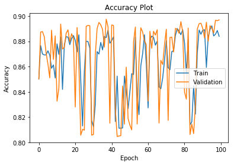


```python
# Plotting Loss

plt.plot(l_tuned_model_history.history['loss'])
plt.plot(l_tuned_model_history.history['val_loss'])
plt.title('Loss Plot')
plt.ylabel('Loss')
plt.xlabel('Epoch')
plt.legend(['Train', 'Validation'])
plt.show()
```


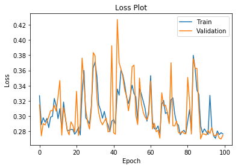


#### Predictions


```python
train_l_tuned_model = l_tuned_model.predict_classes(X_train)
test_l_tuned_model = l_tuned_model.predict_classes(X_test)
```

#### Getting evaluation metrics and evaluating model performance


```python
l_confusion_matrix_train = confusion_matrix(y_train, train_l_tuned_model)
l_confusion_matrix_test = confusion_matrix(y_test, test_l_tuned_model)

print(l_confusion_matrix_train)
print(l_confusion_matrix_test)
```

    [[30868  1601]
     [ 2530  5074]]
    [[13256   660]
     [ 1113  2146]]


#### Calculate Accuracy, True Positive Rate and True Negative Rates


```python
Accuracy_Train_l =(l_confusion_matrix_train[0,0]+l_confusion_matrix_train[1,1])/(l_confusion_matrix_train[0,0]+l_confusion_matrix_train[0,1]+l_confusion_matrix_train[1,0]+l_confusion_matrix_train[1,1])
TNR_Train_l = l_confusion_matrix_train[0,0]/(l_confusion_matrix_train[0,0]+l_confusion_matrix_train[0,1])
TPR_Train_l = l_confusion_matrix_train[1,1]/(l_confusion_matrix_train[1,0]+l_confusion_matrix_train[1,1])

print("Train TNR: ",TNR_Train_l)
print("Train TPR: ",TPR_Train_l)
print("Train Accuracy: ",Accuracy_Train_l)

print("-----------------------")

Accuracy_Test_l = (l_confusion_matrix_test[0,0]+l_confusion_matrix_test[1,1])/(l_confusion_matrix_test[0,0]+l_confusion_matrix_test[0,1]+l_confusion_matrix_test[1,0]+l_confusion_matrix_test[1,1])
TNR_Test_l = l_confusion_matrix_test[0,0]/(l_confusion_matrix_test[0,0] +l_confusion_matrix_test[0,1])
TPR_Test_l = l_confusion_matrix_test[1,1]/(l_confusion_matrix_test[1,0] +l_confusion_matrix_test[1,1])

print("Test TNR: ",TNR_Test_l)
print("Test TPR: ",TPR_Test_l)
print("Test Accuracy: ",Accuracy_Test_l)

print("-----------------------")

```

    Train TNR:  0.9506914287474206
    Train TPR:  0.6672803787480274
    Train Accuracy:  0.8969131335313054
    -----------------------
    Test TNR:  0.9525725783271055
    Test TPR:  0.6584841976066278
    Test Accuracy:  0.8967685589519651
    -----------------------


#### Find the best Batch size 


```python
#l_rate = np.logspace(0.0001,1,8)
#l_rate = 10**(-2.3 * np.random.rand(6))
b_size = [32, 64, 128, 256, 500]
b_size

```


    [32, 64, 128, 256, 500]


```python
b_hist_loss=[]
b_hist_acc=[]

for b_size_v in b_size:
    
    #Fit the model
    b_l_tuned_model_history = l_tuned_model.fit(X_train, y_train, epochs=1,
                                       batch_size=b_size_v, validation_split=0.2,
                                       use_multiprocessing=True)

    b_hist_loss.append(b_l_tuned_model_history.history['val_loss'])
    b_hist_acc.append(b_l_tuned_model_history.history['val_accuracy'])
```

    Train on 32058 samples, validate on 8015 samples
    Epoch 1/1
    32058/32058 [==============================] - 1s 39us/step - loss: 0.2968 - accuracy: 0.8700 - val_loss: 0.2801 - val_accuracy: 0.8926
    Train on 32058 samples, validate on 8015 samples
    Epoch 1/1
    32058/32058 [==============================] - 1s 22us/step - loss: 0.2887 - accuracy: 0.8831 - val_loss: 0.2722 - val_accuracy: 0.8946
    Train on 32058 samples, validate on 8015 samples
    Epoch 1/1
    32058/32058 [==============================] - 0s 11us/step - loss: 0.2692 - accuracy: 0.8949 - val_loss: 0.2702 - val_accuracy: 0.8952
    Train on 32058 samples, validate on 8015 samples
    Epoch 1/1
    32058/32058 [==============================] - 0s 6us/step - loss: 0.2694 - accuracy: 0.8923 - val_loss: 0.2705 - val_accuracy: 0.8952
    Train on 32058 samples, validate on 8015 samples
    Epoch 1/1
    32058/32058 [==============================] - 0s 4us/step - loss: 0.2680 - accuracy: 0.8929 - val_loss: 0.2705 - val_accuracy: 0.8948


```python
# Get the Learning rate and loss Dataframe
b_size_t = pd.DataFrame([b_size, b_hist_loss, b_hist_acc]).T  

#Give the coloumn names
b_size_t.columns=['b_size','val_loss','val_accuracy']

#Sort the values and reset the index
b_size_t=b_size_t.sort_values('val_loss').reset_index().drop('index',axis=1)
b_size_t
```


<div>
<style scoped>
    .dataframe tbody tr th:only-of-type {
        vertical-align: middle;
    }

    .dataframe tbody tr th {
        vertical-align: top;
    }

    .dataframe thead th {
        text-align: right;
    }
</style>
<table border="1" class="dataframe">
  <thead>
    <tr style="text-align: right;">
      <th></th>
      <th>b_size</th>
      <th>val_loss</th>
      <th>val_accuracy</th>
    </tr>
  </thead>
  <tbody>
    <tr>
      <th>0</th>
      <td>128</td>
      <td>[0.2701838998741012]</td>
      <td>[0.8951964974403381]</td>
    </tr>
    <tr>
      <th>1</th>
      <td>500</td>
      <td>[0.27050521490132146]</td>
      <td>[0.8948221802711487]</td>
    </tr>
    <tr>
      <th>2</th>
      <td>256</td>
      <td>[0.2705338045276111]</td>
      <td>[0.8951964974403381]</td>
    </tr>
    <tr>
      <th>3</th>
      <td>64</td>
      <td>[0.2722331180136723]</td>
      <td>[0.8945726752281189]</td>
    </tr>
    <tr>
      <th>4</th>
      <td>32</td>
      <td>[0.28006285797858044]</td>
      <td>[0.8925763964653015]</td>
    </tr>
  </tbody>
</table>
</div>


```python
best_b_size_v=b_size_t.iloc[0][0]
best_b_size_v
```


    128


#### Build model with the best batch size


```python
b_l_tuned_model_history = l_tuned_model.fit(X_train, y_train, epochs=100,
                                       batch_size=best_b_size_v, validation_split=0.2,
                                       use_multiprocessing=True)
```

    Train on 32058 samples, validate on 8015 samples
    Epoch 1/100
    32058/32058 [==============================] - 0s 11us/step - loss: 0.2764 - accuracy: 0.8912 - val_loss: 0.2720 - val_accuracy: 0.8923
    Epoch 2/100
    32058/32058 [==============================] - 0s 11us/step - loss: 0.2680 - accuracy: 0.8938 - val_loss: 0.2705 - val_accuracy: 0.8947
    Epoch 3/100
    32058/32058 [==============================] - 0s 11us/step - loss: 0.2695 - accuracy: 0.8935 - val_loss: 0.2693 - val_accuracy: 0.8983
    Epoch 4/100
    32058/32058 [==============================] - 0s 11us/step - loss: 0.2690 - accuracy: 0.8935 - val_loss: 0.2705 - val_accuracy: 0.8973
    Epoch 5/100
    32058/32058 [==============================] - 0s 12us/step - loss: 0.2703 - accuracy: 0.8937 - val_loss: 0.2700 - val_accuracy: 0.8972
    Epoch 6/100
    32058/32058 [==============================] - 0s 11us/step - loss: 0.2712 - accuracy: 0.8893 - val_loss: 0.2701 - val_accuracy: 0.8957
    Epoch 7/100
    32058/32058 [==============================] - 0s 11us/step - loss: 0.2783 - accuracy: 0.8887 - val_loss: 0.2719 - val_accuracy: 0.8959
    Epoch 8/100
    32058/32058 [==============================] - 0s 11us/step - loss: 0.2973 - accuracy: 0.8791 - val_loss: 0.3996 - val_accuracy: 0.8218
    Epoch 9/100
    32058/32058 [==============================] - 0s 11us/step - loss: 0.3020 - accuracy: 0.8771 - val_loss: 0.2695 - val_accuracy: 0.8968
    Epoch 10/100
    32058/32058 [==============================] - 0s 11us/step - loss: 0.2713 - accuracy: 0.8933 - val_loss: 0.2720 - val_accuracy: 0.8930
    Epoch 11/100
    32058/32058 [==============================] - 0s 11us/step - loss: 0.2686 - accuracy: 0.8948 - val_loss: 0.2685 - val_accuracy: 0.8958
    Epoch 12/100
    32058/32058 [==============================] - 0s 11us/step - loss: 0.2703 - accuracy: 0.8918 - val_loss: 0.2842 - val_accuracy: 0.8918
    Epoch 13/100
    32058/32058 [==============================] - 0s 11us/step - loss: 0.2695 - accuracy: 0.8909 - val_loss: 0.2745 - val_accuracy: 0.8891
    Epoch 14/100
    32058/32058 [==============================] - 0s 11us/step - loss: 0.2753 - accuracy: 0.8918 - val_loss: 0.2690 - val_accuracy: 0.8962
    Epoch 15/100
    32058/32058 [==============================] - 0s 11us/step - loss: 0.2768 - accuracy: 0.8832 - val_loss: 0.2813 - val_accuracy: 0.8946
    Epoch 16/100
    32058/32058 [==============================] - 0s 11us/step - loss: 0.2740 - accuracy: 0.8864 - val_loss: 0.2892 - val_accuracy: 0.8697
    Epoch 17/100
    32058/32058 [==============================] - 0s 11us/step - loss: 0.2685 - accuracy: 0.8914 - val_loss: 0.2721 - val_accuracy: 0.8902
    Epoch 18/100
    32058/32058 [==============================] - 0s 11us/step - loss: 0.3000 - accuracy: 0.8794 - val_loss: 0.2734 - val_accuracy: 0.8954
    Epoch 19/100
    32058/32058 [==============================] - 0s 11us/step - loss: 0.2678 - accuracy: 0.8955 - val_loss: 0.2701 - val_accuracy: 0.8961
    Epoch 20/100
    32058/32058 [==============================] - 0s 11us/step - loss: 0.2675 - accuracy: 0.8930 - val_loss: 0.2694 - val_accuracy: 0.8958
    Epoch 21/100
    32058/32058 [==============================] - 0s 11us/step - loss: 0.2823 - accuracy: 0.8879 - val_loss: 0.2743 - val_accuracy: 0.8953
    Epoch 22/100
    32058/32058 [==============================] - 0s 11us/step - loss: 0.2668 - accuracy: 0.8952 - val_loss: 0.2690 - val_accuracy: 0.8962
    Epoch 23/100
    32058/32058 [==============================] - 0s 11us/step - loss: 0.2679 - accuracy: 0.8942 - val_loss: 0.2715 - val_accuracy: 0.8948
    Epoch 24/100
    32058/32058 [==============================] - 0s 11us/step - loss: 0.3625 - accuracy: 0.7923 - val_loss: 0.3749 - val_accuracy: 0.8061
    Epoch 25/100
    32058/32058 [==============================] - 0s 11us/step - loss: 0.3669 - accuracy: 0.8127 - val_loss: 0.3724 - val_accuracy: 0.8066
    Epoch 26/100
    32058/32058 [==============================] - 0s 11us/step - loss: 0.3615 - accuracy: 0.8153 - val_loss: 0.3581 - val_accuracy: 0.8242
    Epoch 27/100
    32058/32058 [==============================] - 0s 11us/step - loss: 0.3419 - accuracy: 0.8404 - val_loss: 0.3275 - val_accuracy: 0.8631
    Epoch 28/100
    32058/32058 [==============================] - 0s 11us/step - loss: 0.3052 - accuracy: 0.8802 - val_loss: 0.2976 - val_accuracy: 0.8925
    Epoch 29/100
    32058/32058 [==============================] - 0s 11us/step - loss: 0.2931 - accuracy: 0.8874 - val_loss: 0.2934 - val_accuracy: 0.8920
    Epoch 30/100
    32058/32058 [==============================] - 0s 10us/step - loss: 0.3338 - accuracy: 0.8483 - val_loss: 0.2998 - val_accuracy: 0.8896
    Epoch 31/100
    32058/32058 [==============================] - 0s 10us/step - loss: 0.2983 - accuracy: 0.8816 - val_loss: 0.2936 - val_accuracy: 0.8913
    Epoch 32/100
    32058/32058 [==============================] - 0s 11us/step - loss: 0.2853 - accuracy: 0.8904 - val_loss: 0.2920 - val_accuracy: 0.8871
    Epoch 33/100
    32058/32058 [==============================] - 0s 11us/step - loss: 0.3011 - accuracy: 0.8764 - val_loss: 0.2975 - val_accuracy: 0.8833
    Epoch 34/100
    32058/32058 [==============================] - 0s 11us/step - loss: 0.2884 - accuracy: 0.8864 - val_loss: 0.2899 - val_accuracy: 0.8897
    Epoch 35/100
    32058/32058 [==============================] - 0s 10us/step - loss: 0.3177 - accuracy: 0.8616 - val_loss: 0.3571 - val_accuracy: 0.8251
    Epoch 36/100
    32058/32058 [==============================] - 0s 11us/step - loss: 0.2900 - accuracy: 0.8841 - val_loss: 0.3635 - val_accuracy: 0.8366
    Epoch 37/100
    32058/32058 [==============================] - 0s 11us/step - loss: 0.2815 - accuracy: 0.8895 - val_loss: 0.2869 - val_accuracy: 0.8876
    Epoch 38/100
    32058/32058 [==============================] - 0s 11us/step - loss: 0.3233 - accuracy: 0.8566 - val_loss: 0.2896 - val_accuracy: 0.8911
    Epoch 39/100
    32058/32058 [==============================] - 0s 11us/step - loss: 0.2886 - accuracy: 0.8824 - val_loss: 0.2841 - val_accuracy: 0.8923
    Epoch 40/100
    32058/32058 [==============================] - 0s 11us/step - loss: 0.3299 - accuracy: 0.8476 - val_loss: 0.3645 - val_accuracy: 0.8062
    Epoch 41/100
    32058/32058 [==============================] - 0s 11us/step - loss: 0.3511 - accuracy: 0.8120 - val_loss: 0.3569 - val_accuracy: 0.8060
    Epoch 42/100
    32058/32058 [==============================] - 0s 11us/step - loss: 0.3469 - accuracy: 0.8120 - val_loss: 0.3524 - val_accuracy: 0.8061
    Epoch 43/100
    32058/32058 [==============================] - 0s 11us/step - loss: 0.3430 - accuracy: 0.8121 - val_loss: 0.3465 - val_accuracy: 0.8061
    Epoch 44/100
    32058/32058 [==============================] - 0s 11us/step - loss: 0.3382 - accuracy: 0.8122 - val_loss: 0.3366 - val_accuracy: 0.8061
    Epoch 45/100
    32058/32058 [==============================] - 0s 11us/step - loss: 0.3224 - accuracy: 0.8161 - val_loss: 0.3057 - val_accuracy: 0.8575
    Epoch 46/100
    32058/32058 [==============================] - 0s 10us/step - loss: 0.2911 - accuracy: 0.8777 - val_loss: 0.2862 - val_accuracy: 0.8865
    Epoch 47/100
    32058/32058 [==============================] - 0s 11us/step - loss: 0.2801 - accuracy: 0.8871 - val_loss: 0.2818 - val_accuracy: 0.8908
    Epoch 48/100
    32058/32058 [==============================] - 0s 10us/step - loss: 0.2762 - accuracy: 0.8909 - val_loss: 0.2794 - val_accuracy: 0.8903
    Epoch 49/100
    32058/32058 [==============================] - 0s 11us/step - loss: 0.2805 - accuracy: 0.8830 - val_loss: 0.2777 - val_accuracy: 0.8931
    Epoch 50/100
    32058/32058 [==============================] - 0s 11us/step - loss: 0.2909 - accuracy: 0.8852 - val_loss: 0.2749 - val_accuracy: 0.8954
    Epoch 51/100
    32058/32058 [==============================] - 0s 11us/step - loss: 0.2715 - accuracy: 0.8948 - val_loss: 0.2724 - val_accuracy: 0.8956
    Epoch 52/100
    32058/32058 [==============================] - 0s 11us/step - loss: 0.2700 - accuracy: 0.8943 - val_loss: 0.2720 - val_accuracy: 0.8944
    Epoch 53/100
    32058/32058 [==============================] - 0s 11us/step - loss: 0.3307 - accuracy: 0.8590 - val_loss: 0.3895 - val_accuracy: 0.8086
    Epoch 54/100
    32058/32058 [==============================] - 0s 11us/step - loss: 0.3732 - accuracy: 0.8174 - val_loss: 0.3755 - val_accuracy: 0.8133
    Epoch 55/100
    32058/32058 [==============================] - 0s 11us/step - loss: 0.3654 - accuracy: 0.8224 - val_loss: 0.3635 - val_accuracy: 0.8232
    Epoch 56/100
    32058/32058 [==============================] - 0s 11us/step - loss: 0.3258 - accuracy: 0.8575 - val_loss: 0.2779 - val_accuracy: 0.8953
    Epoch 57/100
    32058/32058 [==============================] - 0s 11us/step - loss: 0.2906 - accuracy: 0.8755 - val_loss: 0.3416 - val_accuracy: 0.8076
    Epoch 58/100
    32058/32058 [==============================] - 0s 11us/step - loss: 0.3099 - accuracy: 0.8370 - val_loss: 0.2879 - val_accuracy: 0.8840
    Epoch 59/100
    32058/32058 [==============================] - 0s 11us/step - loss: 0.2761 - accuracy: 0.8873 - val_loss: 0.2744 - val_accuracy: 0.8963
    Epoch 60/100
    32058/32058 [==============================] - 0s 11us/step - loss: 0.2736 - accuracy: 0.8888 - val_loss: 0.2761 - val_accuracy: 0.8902
    Epoch 61/100
    32058/32058 [==============================] - 0s 11us/step - loss: 0.2709 - accuracy: 0.8938 - val_loss: 0.2719 - val_accuracy: 0.8947
    Epoch 62/100
    32058/32058 [==============================] - 0s 11us/step - loss: 0.2697 - accuracy: 0.8938 - val_loss: 0.2704 - val_accuracy: 0.8968
    Epoch 63/100
    32058/32058 [==============================] - 0s 11us/step - loss: 0.2687 - accuracy: 0.8957 - val_loss: 0.2710 - val_accuracy: 0.8978
    Epoch 64/100
    32058/32058 [==============================] - 0s 11us/step - loss: 0.2739 - accuracy: 0.8894 - val_loss: 0.2713 - val_accuracy: 0.8964
    Epoch 65/100
    32058/32058 [==============================] - 0s 11us/step - loss: 0.2688 - accuracy: 0.8928 - val_loss: 0.2703 - val_accuracy: 0.8956
    Epoch 66/100
    32058/32058 [==============================] - 0s 11us/step - loss: 0.2714 - accuracy: 0.8904 - val_loss: 0.2723 - val_accuracy: 0.8927
    Epoch 67/100
    32058/32058 [==============================] - 0s 11us/step - loss: 0.2724 - accuracy: 0.8889 - val_loss: 0.2912 - val_accuracy: 0.8705
    Epoch 68/100
    32058/32058 [==============================] - 0s 11us/step - loss: 0.2712 - accuracy: 0.8893 - val_loss: 0.2764 - val_accuracy: 0.8963
    Epoch 69/100
    32058/32058 [==============================] - 0s 11us/step - loss: 0.3273 - accuracy: 0.8521 - val_loss: 0.4367 - val_accuracy: 0.8074
    Epoch 70/100
    32058/32058 [==============================] - 0s 11us/step - loss: 0.3795 - accuracy: 0.8150 - val_loss: 0.3732 - val_accuracy: 0.8155
    Epoch 71/100
    32058/32058 [==============================] - 0s 11us/step - loss: 0.3675 - accuracy: 0.8200 - val_loss: 0.3706 - val_accuracy: 0.8161
    Epoch 72/100
    32058/32058 [==============================] - 0s 11us/step - loss: 0.3653 - accuracy: 0.8206 - val_loss: 0.3683 - val_accuracy: 0.8186
    Epoch 73/100
    32058/32058 [==============================] - 0s 11us/step - loss: 0.3629 - accuracy: 0.8212 - val_loss: 0.3662 - val_accuracy: 0.8181
    Epoch 74/100
    32058/32058 [==============================] - 0s 11us/step - loss: 0.3604 - accuracy: 0.8242 - val_loss: 0.3648 - val_accuracy: 0.8221
    Epoch 75/100
    32058/32058 [==============================] - 0s 11us/step - loss: 0.3574 - accuracy: 0.8288 - val_loss: 0.3602 - val_accuracy: 0.8253
    Epoch 76/100
    32058/32058 [==============================] - 0s 11us/step - loss: 0.3253 - accuracy: 0.8610 - val_loss: 0.2909 - val_accuracy: 0.8876
    Epoch 77/100
    32058/32058 [==============================] - 0s 11us/step - loss: 0.2809 - accuracy: 0.8905 - val_loss: 0.2807 - val_accuracy: 0.8948
    Epoch 78/100
    32058/32058 [==============================] - 0s 11us/step - loss: 0.3164 - accuracy: 0.8677 - val_loss: 0.3644 - val_accuracy: 0.8252
    Epoch 79/100
    32058/32058 [==============================] - 0s 11us/step - loss: 0.3231 - accuracy: 0.8607 - val_loss: 0.2878 - val_accuracy: 0.8918
    Epoch 80/100
    32058/32058 [==============================] - 0s 10us/step - loss: 0.2957 - accuracy: 0.8822 - val_loss: 0.2791 - val_accuracy: 0.8952
    Epoch 81/100
    32058/32058 [==============================] - 0s 11us/step - loss: 0.2753 - accuracy: 0.8947 - val_loss: 0.2779 - val_accuracy: 0.8957
    Epoch 82/100
    32058/32058 [==============================] - 0s 11us/step - loss: 0.2775 - accuracy: 0.8896 - val_loss: 0.2776 - val_accuracy: 0.8957
    Epoch 83/100
    32058/32058 [==============================] - 0s 11us/step - loss: 0.2749 - accuracy: 0.8940 - val_loss: 0.2778 - val_accuracy: 0.8959
    Epoch 84/100
    32058/32058 [==============================] - 0s 11us/step - loss: 0.2724 - accuracy: 0.8943 - val_loss: 0.2850 - val_accuracy: 0.8925
    Epoch 85/100
    32058/32058 [==============================] - 0s 11us/step - loss: 0.2696 - accuracy: 0.8967 - val_loss: 0.2719 - val_accuracy: 0.8964
    Epoch 86/100
    32058/32058 [==============================] - 0s 10us/step - loss: 0.2692 - accuracy: 0.8950 - val_loss: 0.2728 - val_accuracy: 0.8962
    Epoch 87/100
    32058/32058 [==============================] - 0s 11us/step - loss: 0.2684 - accuracy: 0.8955 - val_loss: 0.2704 - val_accuracy: 0.8973
    Epoch 88/100
    32058/32058 [==============================] - 0s 11us/step - loss: 0.2677 - accuracy: 0.8965 - val_loss: 0.2698 - val_accuracy: 0.8973
    Epoch 89/100
    32058/32058 [==============================] - 0s 11us/step - loss: 0.2695 - accuracy: 0.8918 - val_loss: 0.2705 - val_accuracy: 0.8969
    Epoch 90/100
    32058/32058 [==============================] - 0s 11us/step - loss: 0.2710 - accuracy: 0.8897 - val_loss: 0.2744 - val_accuracy: 0.8915
    Epoch 91/100
    32058/32058 [==============================] - 0s 11us/step - loss: 0.2674 - accuracy: 0.8942 - val_loss: 0.2738 - val_accuracy: 0.8971
    Epoch 92/100
    32058/32058 [==============================] - 0s 11us/step - loss: 0.2671 - accuracy: 0.8957 - val_loss: 0.2781 - val_accuracy: 0.8865
    Epoch 93/100
    32058/32058 [==============================] - 0s 11us/step - loss: 0.2700 - accuracy: 0.8927 - val_loss: 0.2738 - val_accuracy: 0.8901
    Epoch 94/100
    32058/32058 [==============================] - 0s 11us/step - loss: 0.2833 - accuracy: 0.8850 - val_loss: 0.3456 - val_accuracy: 0.8599
    Epoch 95/100
    32058/32058 [==============================] - 0s 11us/step - loss: 0.2704 - accuracy: 0.8957 - val_loss: 0.2699 - val_accuracy: 0.8979
    Epoch 96/100
    32058/32058 [==============================] - 0s 11us/step - loss: 0.2924 - accuracy: 0.8827 - val_loss: 0.2779 - val_accuracy: 0.8881
    Epoch 97/100
    32058/32058 [==============================] - 0s 11us/step - loss: 0.2726 - accuracy: 0.8914 - val_loss: 0.2908 - val_accuracy: 0.8877
    Epoch 98/100
    32058/32058 [==============================] - 0s 11us/step - loss: 0.2884 - accuracy: 0.8852 - val_loss: 0.2740 - val_accuracy: 0.8923
    Epoch 99/100
    32058/32058 [==============================] - 0s 11us/step - loss: 0.2682 - accuracy: 0.8939 - val_loss: 0.2774 - val_accuracy: 0.8877
    Epoch 100/100
    32058/32058 [==============================] - 0s 11us/step - loss: 0.2720 - accuracy: 0.8881 - val_loss: 0.2726 - val_accuracy: 0.8933


```python
# Plotting Accuracy

plt.plot(b_l_tuned_model_history.history['accuracy'])
plt.plot(b_l_tuned_model_history.history['val_accuracy'])
plt.title('Accuracy Plot')
plt.ylabel('Accuracy')
plt.xlabel('Epoch')
plt.legend(['Train', 'Validation'])
plt.show()
```


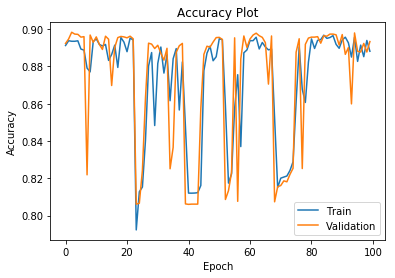


```python
# Plotting Loss

plt.plot(b_l_tuned_model_history.history['loss'])
plt.plot(b_l_tuned_model_history.history['val_loss'])
plt.title('Loss Plot')
plt.ylabel('Loss')
plt.xlabel('Epoch')
plt.legend(['Train', 'Validation'])
plt.show()
```


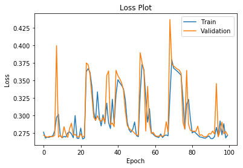


#### Predictions


```python
train_b_l_tuned_model = l_tuned_model.predict_classes(X_train)
test_b_l_tuned_model = l_tuned_model.predict_classes(X_test)
```

#### Getting evaluation metrics and evaluating model performance


```python
b_l_confusion_matrix_train = confusion_matrix(y_train, train_b_l_tuned_model)
b_l_confusion_matrix_test = confusion_matrix(y_test, test_b_l_tuned_model)

print(b_l_confusion_matrix_train)
print(b_l_confusion_matrix_test)
```

    [[30000  2469]
     [ 1862  5742]]
    [[12874  1042]
     [  820  2439]]


#### Calculate Accuracy, True Positive Rate and True Negative Rates


```python
Accuracy_Train_l_b =(b_l_confusion_matrix_train[0,0]+b_l_confusion_matrix_train[1,1])/(b_l_confusion_matrix_train[0,0]+b_l_confusion_matrix_train[0,1]+b_l_confusion_matrix_train[1,0]+b_l_confusion_matrix_train[1,1])
TNR_Train_l_b = b_l_confusion_matrix_train[0,0]/(b_l_confusion_matrix_train[0,0]+b_l_confusion_matrix_train[0,1])
TNR_Train_l_b = b_l_confusion_matrix_train[1,1]/(b_l_confusion_matrix_train[1,0]+b_l_confusion_matrix_train[1,1])

print("Train TNR: ",TNR_Train_l_b)
print("Train TPR: ",TNR_Train_l_b)
print("Train Accuracy: ",Accuracy_Train_l_b)

print("-----------------------")

Accuracy_Test_l_b = (b_l_confusion_matrix_test[0,0]+b_l_confusion_matrix_test[1,1])/(b_l_confusion_matrix_test[0,0]+b_l_confusion_matrix_test[0,1]+b_l_confusion_matrix_test[1,0]+b_l_confusion_matrix_test[1,1])
TNR_Test_l_b = b_l_confusion_matrix_test[0,0]/(b_l_confusion_matrix_test[0,0] +b_l_confusion_matrix_test[0,1])
TPR_Test_l_b = b_l_confusion_matrix_test[1,1]/(b_l_confusion_matrix_test[1,0] +b_l_confusion_matrix_test[1,1])

print("Test TNR: ",TNR_Test_l_b)
print("Test TPR: ",TPR_Test_l_b)
print("Test Accuracy: ",Accuracy_Test_l_b)

print("-----------------------")

```

    Train TNR:  0.7551288795370857
    Train TPR:  0.7551288795370857
    Train Accuracy:  0.891922241908517
    -----------------------
    Test TNR:  0.9251221615406726
    Test TPR:  0.7483890764038048
    Test Accuracy:  0.8915866084425036
    -----------------------


```python
# Get Model Summary:
print(l_tuned_model.summary())

# Vizualize the model:
plot_model(l_tuned_model, to_file='l_tuned_model.png', show_shapes=True, show_layer_names=True) # to_file='model_plot.png'

```

    Model: "sequential_15"
    _________________________________________________________________
    Layer (type)                 Output Shape              Param #   
    =================================================================
    dense_30 (Dense)             (None, 15)                330       
    _________________________________________________________________
    dense_31 (Dense)             (None, 1)                 16        
    =================================================================
    Total params: 346
    Trainable params: 346
    Non-trainable params: 0
    _________________________________________________________________
    None


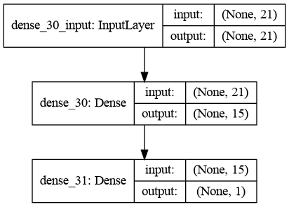


### Reference Links:

https://machinelearningmastery.com/adam-optimization-algorithm-for-deep-learning/

https://keras.io/


```python

```
